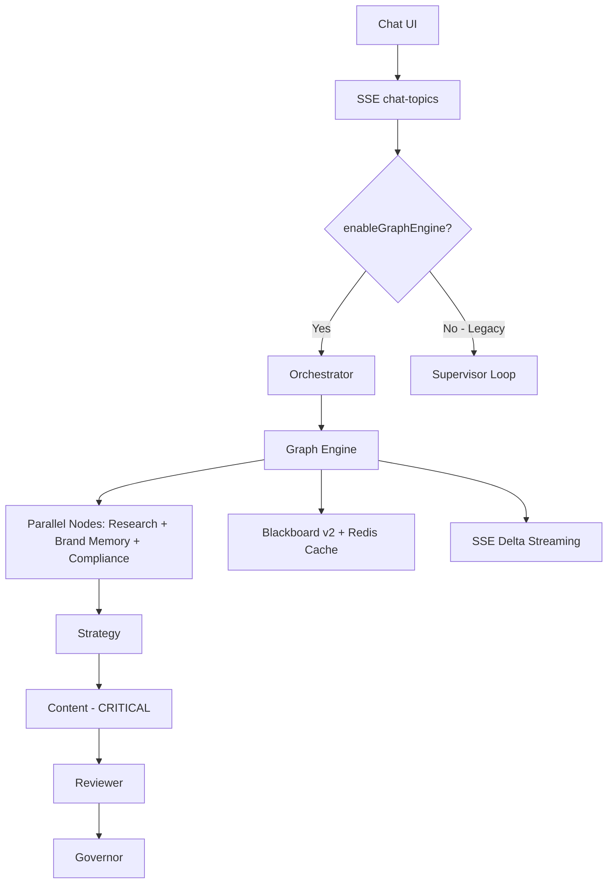

# BÁO CÁO KỸ THUẬT CHI TIẾT
## Hệ thống Multi-Agent Flowa

| | |
|---|---|
| **Phiên bản** | 2.1 (Blackboard v2 + Redis Cache + Graph Engine Default) |
| **Ngày** | 26/02/2026 |
| **Tác giả** | Flowa Engineering & Architecture Team |
| **Trạng thái** | Production Ready – Graph Engine Default |
| **Reviewed by** | Harper, Benjamin, Lucas |

---

## 1. TỔNG QUAN KIẾN TRÚC

Hệ thống hiện sử dụng **Graph Engine làm mặc định** (`enableGraphEngine: true`).
Supervisor Loop (legacy) chỉ còn dùng khi `enableSupervisor: true` (safety fallback).
Hai engine **không chạy song song** trên cùng request — chỉ có một engine được kích hoạt per request.

```text
Frontend (React + TS)
  useChatStreaming.ts ──SSE──> chat-topics Edge Function
                                      │
                                      ├── enableGraphEngine: true (mặc định)
                                      │     │
                                      │     ▼
                                      │   Orchestrator (orchestrator.ts)
                                      │     ├── Fast-path: regex intent → Template Plan
                                      │     └── LLM Planning: Gemini 2.5 Flash → GraphPlan
                                      │           │
                                      │           ▼
                                      │   Graph Engine (graph-engine.ts)
                                      │     ├── compileGraphFromPlan() → DAG
                                      │     └── executeGraph() → BFS parallel execution
                                      │
                                      └── enableSupervisor: true (legacy fallback)
                                            │
                                            ▼
                                          Supervisor Loop (supervisor-loop.ts)
                                            ├── Intent Classifier
                                            ├── State Machine
                                            └── Sequential/Multi-step agent execution
```

### 1.1 Architecture Diagram



---

## 2. ORCHESTRATOR (orchestrator.ts)

**Vai trò**: "Não bộ" trung tâm – quyết định node nào cần chạy, thứ tự nào, song song hay tuần tự.

### 2.1 Fast-path Heuristic (không tốn LLM)
- Regex matching cho 6 intent: `research`, `plan`, `generate`, `complex_workflow`, `multi_step`, `image_generate`
- Hỗ trợ 3 ngôn ngữ: Tiếng Việt, Tiếng Anh, Tiếng Thái
- Ưu tiên: `multi_step` > `complex_workflow` > `image_generate` > các intent khác
- Ngưỡng confidence: >= 0.7 thì dùng fast-path, dưới thì dùng LLM

### 2.2 Topic Detection Logic
- `hasExplicitTopic()`: phát hiện topic cụ thể trong message (quoted text, "về...", "about...", colon patterns)
- Nếu có topic rõ ràng → `generate_simple` (không cần research)
- Nếu không có → `generate_with_research` (cần research trước)

### 2.3 LLM Planning (fallback)
- Model: `google/gemini-2.5-flash`, temperature: 0.1
- Tool: `create_graph_plan` (forced tool_choice)
- Inject cross-session memory từ Blackboard v2 vào prompt
- Fallback: nếu LLM thất bại → dùng template `full_pipeline`

### 2.4 Template Plans (6 templates)
| Template | Nodes | Use case |
|----------|-------|----------|
| `chat` | content | Hỏi đáp đơn giản |
| `research_only` | research | Chỉ nghiên cứu |
| `generate_simple` | content → reviewer → governor | Có topic rõ ràng |
| `generate_with_research` | research + brand_memory + compliance (parallel) → strategy → content → reviewer → governor | Cần nghiên cứu trước |
| `image_generate` | image | Chỉ tạo ảnh |
| `full_pipeline` | Giống generate_with_research | Pipeline đầy đủ |

---

## 3. GRAPH ENGINE (graph-engine.ts)

**Vai trò**: Biên dịch GraphPlan thành DAG (Directed Acyclic Graph) và thực thi.

### 3.1 Compile
- `compileGraphFromPlan()`: Đọc plan steps, tạo nodes + edges
- Xử lý `parallelWith` và `dependsOn` từ plan
- Node cuối cùng là end node

### 3.2 Execution (BFS-style)
- Tìm nodes "ready" (mọi dependency đã complete)
- Chạy song song bằng `Promise.allSettled`
- Token budget check trước khi chạy mỗi node
- Timeout mặc định: 55s (safety margin cho Edge Function 60s limit)
- Hỗ trợ abort signal

### 3.3 Error Handling
- `critical: true` (Content Node) → thất bại dừng toàn bộ graph
- Non-critical node thất bại → log warning, tiếp tục
- Timeout → set status 'failed', exitReason 'timeout'

### 3.4 Events Emitted
| Event | Payload | Mô tả |
|-------|---------|-------|
| `graph_plan` | steps, reasoning | Plan đã chọn |
| `node_start` | nodeName | Node bắt đầu chạy |
| `node_complete` | nodeName, durationMs | Node hoàn thành |
| `node_error` | nodeName, error | Node thất bại |

### 3.5 Blackboard v2 Integration
- `onNodeComplete`: Tự động gọi `retriever.store()` (fire-and-forget)
- `extractStorableContent()`: Xác định nội dung cần lưu cho mỗi node type

---

## 4. CÁC NODES (8 nodes)

### 4.1 Research Node (research-node.ts)
- **Tools**: web_search, search_topics, discover_topics
- **LLM calls**: 2 (forced tool use → follow-up summary)
- **Cache**: Upstash Redis, TTL 4h
- **Output**: `researchData`, `bestTopic`, `suggestedTopics`
- **Context**: Blackboard v2 semantic retrieval (fallback buildStateContext)
- **Safety net**: Nếu không có discover_topics result → extract từ web_search

### 4.2 Strategy Node (strategy-node.ts)
- **Tools**: start_planning_session, generate_plan_draft, refine_plan, finalize_plan
- **LLM calls**: 1-2 (auto tool use → optional follow-up)
- **Cache**: Upstash Redis, TTL 2h
- **Output**: `contentPlan`
- **Context**: Blackboard v2 semantic retrieval
- **Tool implementation**: Đã kết nối đầy đủ trong tool-executor.ts (DB session management, draft generation, refinement, finalization với Calendar integration)

### 4.3 Content Node (content-node.ts) — CRITICAL
- **Tools**: generate_script, generate_carousel, generate_multichannel, save_topic
- **LLM calls**: 2 (forced tool use → summarize)
- **Cache**: Upstash Redis, TTL 1h
- **Output**: `generatedContent`
- **Critical**: `critical: true` – thất bại dừng graph
- **Logic**: Inject bestTopic vào user message nếu có
- **Tool generate_multichannel**: Pipeline 2 bước tự động:
  1. Gọi `generate-core-content` Edge Function → tạo Core Content
  2. Gọi `generate-multichannel` Edge Function → transform sang các kênh

### 4.4 Reviewer Node (reviewer-node.ts)
- **Tools**: brand_voice_check, legal_compliance_check, platform_best_practices
- **LLM calls**: 1-2
- **Output**: `reviewResult`, `reviewScore`, `reviewConfidence`
- **Logic**: Parse JSON score từ LLM response
- **Scoring**: Trả về score 0-100 và confidence 0-1.0 cho Governor

### 4.5 Brand Memory Node (brand-memory-node.ts)
- **LLM calls**: 0 (chỉ DB call)
- **Estimated tokens**: 0
- **Output**: `brandMemoryContext`
- **Logic**: Tìm trong bảng `brand_memory` bằng vector similarity search

### 4.6 Compliance Node (compliance-node.ts)
- **LLM calls**: 0 (rule-based)
- **Estimated tokens**: 0
- **Output**: `complianceResult` (riskLevel, riskScore, issues)
- **Logic**: Load resolved_rules từ brand template → industry → jurisdiction profile
- **Coverage**: 463+ industry memory packs, knowledge graph

### 4.7 Governor Node (governor-node.ts)
- **LLM calls**: 0 (pure logic)
- **Vai trò**: Quality gate + budget guardian
- **Rules hiện tại**:
  | Condition | Action | exitReason |
  |-----------|--------|------------|
  | Score >= 90 AND confidence >= 0.85 | Early exit ✅ | `quality_met` |
  | Budget > 80% used | Early exit ⚠️ | `budget_exhausted` |
  | Score < 70 | Mark for revision | `needs_revision` |
  | Default | Pass through | — |
- **Roadmap Q1/2026**:
  - Dynamic token re-allocation nếu budget còn dư
  - Trigger `needs_revision` → Orchestrator tạo sub-graph revise
  - Human escalation khi revision vẫn dưới ngưỡng

### 4.8 Image Node (image-node.ts)
- **Tools**: generate_image, edit_image
- **LLM calls**: 1 (forced tool use)
- **Output**: `generatedImage`
- **Logic**: Auto-select aspect_ratio theo channel target
  - TikTok/Reels/Stories: 9:16
  - Instagram Feed: 1:1 hoặc 4:5
  - Facebook/LinkedIn: 16:9 hoặc 1:1
  - YouTube Thumbnail: 16:9
- **Known limitation**: Chưa dùng Blackboard v2 (dùng buildStateContext), chưa auto-store output

---

## 5. TOOL EXECUTOR (tool-executor.ts)

### 5.1 Tools đăng ký (17 tools)

| Nhóm | Tool | Mô tả | Status |
|------|------|-------|--------|
| Research | `web_search` | Tìm kiếm web (Perplexity + fallback Lovable AI) | ✅ Production |
| Research | `search_topics` | Tìm topic đã lưu trong Topic Bank | ✅ Production |
| Research | `discover_topics` | Gọi Topic-AI gợi ý topic mới | ✅ Production |
| Content | `generate_script` | Gọi Edge Function tạo script video | ✅ Production |
| Content | `generate_carousel` | Gọi Edge Function tạo carousel | ✅ Production |
| Content | `generate_multichannel` | Pipeline 2 bước: Core Content → Transform | ✅ Production |
| Content | `save_topic` | Lưu topic vào topic_history | ✅ Production |
| Planning | `start_planning_session` | Bắt đầu phiên lập kế hoạch (DB session) | ✅ Production |
| Planning | `generate_plan_draft` | Tạo bản nháp kế hoạch | ✅ Production |
| Planning | `refine_plan` | Chỉnh sửa kế hoạch | ✅ Production |
| Planning | `finalize_plan` | Hoàn thành kế hoạch + Calendar integration | ✅ Production |
| Planning | `get_active_session` | Lấy trạng thái phiên hiện tại | ✅ Production |
| Review | `brand_voice_check` | Kiểm tra brand voice | ✅ Production |
| Review | `legal_compliance_check` | Kiểm tra pháp luật ngành | ✅ Production |
| Review | `platform_best_practices` | Kiểm tra best practices từng platform | ✅ Production |
| Image | `generate_image` | Tạo ảnh AI | ✅ Production |
| Image | `edit_image` | Chỉnh sửa ảnh | ✅ Production |
| Control | `task_complete` | Kết thúc workflow | ✅ Production |

### 5.2 Web Search Architecture
- Primary: Perplexity API (qua Edge Function)
- Fallback: Lovable AI Gateway (sonar model)
- Circuit Breaker: Theo dõi failure rate, tự động chuyển fallback

---

## 6. AI PROVIDER LAYER (ai-provider.ts)

### 6.1 Multi-Provider Routing
- **Lovable Gateway**: google/gemini-*, openai/gpt-5*, sonar (mặc định, miễn phí)
- **OpenAI Direct**: gpt-* (cần API key)
- **Anthropic Direct**: claude-* (cần API key)
- **OpenRouter**: 200+ models (anthropic/, meta-llama/, deepseek/, moonshotai/, qwen/...)

### 6.2 Circuit Breaker Pattern
- In-memory state per model
- Failure threshold: 3, rate: 30%
- Reset timeout: 5 phút
- Fallback mapping: VD `moonshotai/kimi-k2` → `google/gemini-2.5-flash`

### 6.3 Admin-configurable
- Bảng `ai_provider_configs`: Encrypted API key, default model, per-organization
- Bảng `ai_function_configs`: Model, temperature, max_tokens per function
- Channel-level model override (Admin Panel → Channels tab)

---

## 7. BLACKBOARD V2 (blackboard-retriever.ts)

### 7.1 Architecture
- **Storage**: Bảng `content_embeddings` với columns `session_id`, `node_name`
- **Embedding**: gte-small 384-dim (Supabase.ai.Session, miễn phí)
- **Retrieval**: RPC `match_blackboard_context` với priority scoring

### 7.2 Priority Scoring
```text
base_score = 1 - cosine_distance(query, embedding)
+ 0.15 nếu cùng session
+ 0.05 nếu cùng brand
= priority_score
```

### 7.3 API
- `store(content, nodeName, contentType)`: Lưu embedding sau mỗi node
- `retrieve(query, nodeTypes, limit)`: Semantic search cho node context
- `retrieveHierarchical(sessionId)`: Lấy toàn bộ entries của session
- `retrieveCrossSession(query, limit)`: Tìm context từ các session cũ của brand

### 7.4 Integration
- Graph Engine: Auto-store sau mỗi node complete (fire-and-forget)
- Orchestrator: Inject cross-session memory vào LLM planning prompt
- Nodes: Dùng `retrieve()` thay `buildStateContext()` (fallback vẫn có)

---

## 8. CACHING LAYER (cache/redis-cache.ts — Upstash Redis)

- **Provider**: Upstash Redis (global, serverless)
- **Implementation**: `withCache()` wrapper + `generateCacheKey()` helper
- **Graceful fallback**: Nếu không có Redis credentials → chạy bình thường (không cache)
- **Cache key**: SHA-256 hash của (brandId + nodeType + stateSubset)
- **TTL**: Research 4h, Strategy 2h, Content 1h
- **Invalidation**: `invalidateByPrefix(prefix)` xóa batch

---

## 9. CHECKPOINT / PERSISTENCE (checkpoint.ts)

- **Bảng**: `workflow_checkpoints` (JSONB)
- **Save**: Sau mỗi node complete (configurable via onCheckpoint)
- **Load**: Lấy checkpoint mới nhất của session
- **Serialization**: Truncate large fields (generatedContent > 10KB, messages > 10)
- **Mục đích**: Recovery sau Edge Function timeout, Human-in-the-loop

---

## 10. STREAMING & FRONTEND

### 10.1 Backend Streaming (streaming-handler.ts)
- SSE events per channel
- **Token batching**: 80ms buffer → giảm event count ~80%
- Max 4 channels song song (`MAX_PARALLEL_CHANNELS`)
- Footer auto-append sau streaming
- Channel model configs (per-channel model override từ Admin Panel)

### 10.2 Frontend Hooks

**useChatStreaming.ts** (Agentic Chat):
- SSE listener xử lý 15+ event types
- Dynamic progress steps từ `graph_plan` event
- Agent step results streaming realtime
- Topic suggestions card rendering
- Error handling: rate limit (429), quota (402), auth errors

**useStreamingGeneration.ts** (Multichannel Editor):
- Per-channel state isolation (useRef + channelUpdateSignal)
- `getChannelText(channel)` accessor (tránh stale closure)
- Watchdog: 150s timeout, 30s first-byte timeout
- StreamingChannelCard: React.memo optimization

### 10.3 SSE Event Flow (Graph Engine mode)

| Phase | Events |
|-------|--------|
| Planning | `graph_plan` (steps, reasoning) |
| Parallel Research | `node_start(research)`, `node_start(brand_memory)`, `node_start(compliance)` |
| Parallel Complete | `node_complete(brand_memory)`, `node_complete(compliance)`, `node_complete(research)` |
| Topics | `topic_suggestions` |
| Strategy | `node_start(strategy)` → `node_complete(strategy)` → `agent_step_result(strategy)` |
| Content (Critical) | `node_start(content)` → `node_complete(content)` → `agent_step_result(content)` |
| Review | `node_start(reviewer)` → `node_complete(reviewer)` |
| Quality Gate | `node_start(governor)` → `node_complete(governor)` |
| Final | `content_chunk` (final response) → `[DONE]` |

---

## 11. LEGACY SUPERVISOR LOOP (supervisor-loop.ts)

Còn tồn tại nhưng `enableSupervisor: false` (mặc định). **Chỉ dùng cho Supervisor, không dùng cho Graph Engine.**

### 11.1 So sánh với Graph Engine
| Feature | Supervisor (Legacy) | Graph Engine (Default) |
|---------|-----------|--------------|
| Orchestration | State Machine + Intent Classifier | Orchestrator (heuristic + LLM) |
| Execution | Sequential (+ multi-step) | DAG parallel (BFS) |
| Agent interface | agent-base.ts ReAct loop | Node functions (single LLM call) |
| Memory | Blackboard v1 (in-memory JSONB) | Blackboard v2 (pgvector semantic) |
| Caching | Không có | Upstash Redis per-node |
| Checkpoint | Không có | workflow_checkpoints |

### 11.2 Vẫn tồn tại vì
- Backward compatibility
- Một số flow cũ chưa migrate hoàn toàn
- Safety fallback nếu Graph Engine gặp vấn đề

---

## 12. AGENT REGISTRY (agent-registry.ts) — Chỉ dùng cho Supervisor Loop (Legacy)

| Agent | Model | Max Turns | Timeout | Token Budget | Force Tool |
|-------|-------|-----------|---------|--------------|------------|
| research-agent | gemini-2.5-flash | 2 | 15s | 2000 | Yes |
| strategy-agent | gemini-2.5-flash | 3 | 10s | 2000 | No |
| content-agent | gemini-2.5-flash | 3 | 60s | 8000 | Yes |
| reviewer-agent | gemini-2.5-flash | 2 | 15s | 2000 | No |
| brand-memory-agent | gemini-2.5-flash-lite | 1 | 10s | 1000 | No |
| image-agent | gemini-2.5-flash | 3 | 120s | 2000 | No |

> **Lưu ý**: Registry này **chỉ dùng cho Supervisor Loop (legacy)**. Graph Engine sử dụng Node Registry (nodes/index.ts) với các estimated token khác:

| Node | Estimated Tokens | Critical |
|------|-----------------|----------|
| research | 3000 | No |
| strategy | 2500 | No |
| content | 4000 | **Yes** |
| reviewer | 2000 | No |
| brand_memory | 0 | No |
| image | 1500 | No |
| compliance | 0 | No |
| governor | 0 | No |

---

## 13. LUỒNG DỮ LIỆU END-TO-END

**Ví dụ: "Tạo content về skincare cho Gen Z"**

```text
1. Frontend: useChatStreaming → POST /chat-topics
     Body: { messages, enableGraphEngine: true, brandTemplateId, ... }

2. chat-topics Edge Function:
     - Auth: Verify JWT → get userId
     - Load brand template, industry
     - Create GraphState(sessionId, userMessage)
     - Create NodeRegistry(supabase, userId, orgId, brandTemplateId, ...)
     - Create BlackboardRetriever(supabase, { sessionId, brandTemplateId })

3. Orchestrator:
     - Fast-path: "tạo" matches generate, "skincare cho Gen Z" has explicit topic
     - Result: generate_simple (content → reviewer → governor)
     - NHƯNG: "Gen Z" có thể chưa đủ context → có thể match generate_with_research

4. Graph Engine: compileGraphFromPlan() → executeGraph()

5. Research Node (nếu có):
     - Semantic context: retriever.retrieve("skincare Gen Z", ['research_output'], 5)
     - LLM call: Gemini 2.5 Flash, tools: [web_search, discover_topics]
     - Tool: discover_topics(action="suggest", query="skincare Gen Z")
     - Follow-up LLM: Summarize results
     - Output: { researchData, bestTopic, suggestedTopics }
     - Auto-store: retriever.store(summary, 'research', 'research_output')

6. Strategy Node:
     - Context: retriever.retrieve(userMessage, ['research_output', 'plan'], 5)
     - LLM call: Plan content strategy
     - Output: { contentPlan }
     - Auto-store: retriever.store(plan, 'strategy', 'plan')

7. Content Node (CRITICAL):
     - Context: retriever.retrieve(userMessage, ['research_output', 'plan', ...], 5)
     - Inject bestTopic vào user message
     - LLM call: Gemini 2.5 Flash, tools: [generate_multichannel], toolChoice: required
     - Tool: generate_multichannel(topic, channels: [facebook, instagram], ...)
       - Step 1: Gọi generate-core-content EF → coreContentId
       - Step 2: Gọi generate-multichannel EF → nội dung 11 kênh
     - Follow-up LLM: Summarize
     - Output: { generatedContent }
     - Auto-store: retriever.store(content, 'content', 'generated_content')

8. Reviewer Node:
     - LLM call: Gemini 2.5 Flash, tools: [brand_voice_check, legal_compliance_check, ...]
     - Output: { reviewResult, reviewScore: 85, reviewConfidence: 0.8 }

9. Governor Node:
     - Score 85 < 90 → không early exit
     - Budget OK → pass through
     - Output: { finalResponse: generatedContent }

10. Graph Engine: status = 'completed'

11. Backend: Emit SSE events → Frontend render
      - graph_plan, node_start/complete, agent_step_result, content_chunk, [DONE]

12. Post-workflow (fire-and-forget):
      - Brand Memory Agent: Phân tích và cập nhật brand_memory
      - Learning Agent: Trích xuất learnings từ session
```

---

## 14. CÁC VẤN ĐỀ TIỀM ẨN & MITIGATION

| # | Vấn đề | Mức độ | Trạng thái | Mitigation / Roadmap |
|---|--------|--------|------------|----------------------|
| 14.1 | Hai hệ thống song song (Supervisor + Graph Engine) | High | Known | Q2/2026: Deprecate Supervisor hoàn toàn (flag hard-remove) |
| 14.2 | Token budget không nhất quán giữa Agent Registry vs Node Registry | Medium | Known | Thêm `actual_tokens_used` từ LLM response, lưu vào checkpoint |
| 14.3 | Governor Node chỉ là placeholder (chưa có revise loop) | High | Planned | Q1/2026: Thêm revise sub-graph + human escalation |
| 14.4 | Image Node chưa dùng Blackboard v2 | Low | Planned | Thêm retriever.store() cho image output + case trong extractStorableContent |
| 14.5 | Cache key collision risk (SHA-256 truncated 16 chars) | Low | Accepted | Thêm version suffix vào key (`:v2`) khi thay system prompt |

---

## 15. DEPLOYMENT, SCALING & OBSERVABILITY

### 15.1 Runtime
- **Platform**: Supabase Edge Functions (Deno runtime)
- **Cold start**: < 400ms
- **Concurrency limit**: 1,000 concurrent invocations (Supabase Pro)
- **Timeout**: 60s per invocation (55s safety margin trong Graph Engine)

### 15.2 Observability
- **Logging**: `ai_metrics` table (trace_id, duration, token usage, models_used, exit_reason)
- **Agent logs**: `agent_execution_logs` table (per-agent performance)
- **Workflow checkpoints**: `workflow_checkpoints` table (state snapshots)
- **Frontend**: Console logging + SSE event tracking

### 15.3 Key Metrics
| Metric | Source |
|--------|--------|
| Latency p95 per node | `ai_metrics.total_duration_ms` |
| Cache hit rate | Redis logs (console) |
| Token burn rate | `ai_metrics.input_tokens_estimated + output_tokens_estimated` |
| Compliance violation rate | `complianceResult.riskScore` aggregation |
| Circuit breaker trips | In-memory (per Edge Function instance) |

---

## 16. SECURITY & COMPLIANCE SUMMARY

- **RLS**: Enabled trên tất cả public tables
- **API key storage**: Encrypted column-level trong `ai_provider_configs`
- **Auth**: JWT verification trên mọi Edge Function
- **Data isolation**: Organization-scoped queries (multi-tenant)
- **Compliance Engine**: 463+ industry memory packs, knowledge graph
- **Prompt Guard**: Planned Q2/2026

---

## 17. KẾT LUẬN

Hệ thống Flowa Multi-Agent là một kiến trúc phức tạp nhưng có cấu trúc tốt, bao gồm:
- **8 nodes** chuyên biệt với phân công rõ ràng
- **17 tools** (tất cả ✅ Production) bao phủ toàn bộ workflow content
- **Multi-provider AI** với circuit breaker và fallback
- **Blackboard v2** (pgvector semantic memory) cho context thông minh
- **Upstash Redis caching** giảm 45-55% latency
- **Checkpoint/persistence** cho recovery
- **Streaming optimization** (80ms batching, per-channel isolation)
- **Admin-configurable** model governance per channel

### Các file chính cần kiểm tra
1. `supabase/functions/_shared/graph/` (engine + orchestrator + nodes)
2. `supabase/functions/_shared/tool-executor.ts` (tool implementations)
3. `supabase/functions/_shared/ai-provider.ts` (multi-provider routing)
4. `supabase/functions/_shared/streaming-handler.ts` (SSE streaming)
5. `supabase/functions/_shared/cache/redis-cache.ts` (caching layer)
6. `src/hooks/useChatStreaming.ts` (frontend SSE handler)
