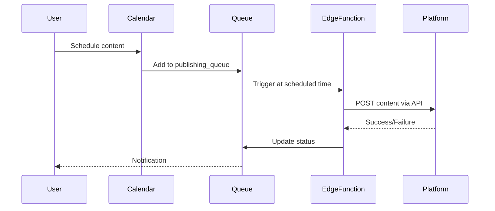

# Core Features - Flowa

> Tổng quan các tính năng chính của nền tảng Flowa

---

## 📋 Mục lục

1. [Three-Pillar Content System](#three-pillar-content-system)
2. [Brand Management](#brand-management)
3. [Campaign System](#campaign-system)
4. [Content Calendar](#content-calendar)
5. [Social Publishing](#social-publishing)
6. [Analytics & Insights](#analytics--insights)

---

## Three-Pillar Content System

Flowa triển khai mô hình **Content Orchestration Flow** 8 lớp:

```
┌─────────────────────────────────────────────────────────────┐
│  1. IDEA          →  Topic Discovery / AI Suggestions       │
│  2. CORE CONTENT  →  Scripts, Carousels, Text               │
│  3. INTENT DECISION →  Seed / Sprout / Harvest              │
│  4. CONTENT ROLE  →  Hero / Hub / Hygiene                   │
│  5. PLATFORM ADAPTER →  Channel-specific formatting         │
│  6. DISTRIBUTION  →  Scheduling & Publishing                │
│  7. MEASURE       →  Performance Analytics                  │
│  8. AMPLIFY       →  Top performer optimization             │
└─────────────────────────────────────────────────────────────┘
```

### Intent Decision Layer (Critical)

| Intent | Mục đích | Content Type |
|--------|----------|--------------|
| **Seed** 🌱 | Awareness - Gieo hạt | Educational, Trend |
| **Sprout** 🌿 | Trust - Nuôi dưỡng | Case study, How-to |
| **Harvest** 🌾 | Conversion - Thu hoạch | Promo, CTA-heavy |

---

### 1. Topics Hub (`/topics`)

**Mô tả**: Trung tâm khám phá và quản lý ý tưởng nội dung với AI Chatbot.

#### Components chính

```
src/components/topic/
├── TopicsHub.tsx              # Main container
├── TopicCard.tsx              # Topic display card
├── TopicFilters.tsx           # Filter controls
├── TopicAIChatbot.tsx         # AI Chat interface
└── chatbot/
    ├── ChatMessageBubble.tsx  # Message rendering
    ├── ChatInputArea.tsx      # Input with tools
    ├── ArtifactsPanel.tsx     # Side panel for results
    ├── DiscoveryTab.tsx       # Topic suggestions
    └── ConversationHistorySidebar.tsx
```

#### AI Chatbot Features

```typescript
// Topic AI capabilities
interface TopicAICapabilities {
  discovery: boolean;      // Khám phá chủ đề mới
  refinement: boolean;     // Tinh chỉnh ý tưởng
  gapAnalysis: boolean;    // Phân tích khoảng trống
  trendAnalysis: boolean;  // Xu hướng thị trường
  competitorScan: boolean; // Phân tích đối thủ
}
```

#### API Endpoint

```typescript
// supabase/functions/topic-ai/index.ts
// Supports streaming responses via SSE

POST /topic-ai
Body: {
  messages: ChatMessage[],
  brandTemplateId: string,
  organizationId: string,
  mode: 'discovery' | 'refinement' | 'analysis'
}
```

---

### 2. Scripts Generator (`/scripts`)

**Mô tả**: Tạo kịch bản video 60-180 giây với AI.

#### Output Structure

```typescript
interface VideoScript {
  id: string;
  title: string;
  duration: '60s' | '90s' | '120s' | '180s';
  style: 'educational' | 'storytelling' | 'promotional';
  
  sections: {
    hook: string;           // 0-5s: Câu mở đầu hấp dẫn
    problem: string;        // 5-20s: Vấn đề khách hàng
    solution: string;       // 20-45s: Giải pháp
    proof: string;          // 45-55s: Bằng chứng/Case study
    cta: string;            // 55-60s: Call to action
  };
  
  visualCues: string[];     // Gợi ý hình ảnh
  audioNotes: string[];     // Gợi ý âm thanh
  hashtags: string[];
}
```

#### Components

```
src/components/scripts/
├── ScriptGenerator.tsx     # Main generator UI
├── ScriptEditor.tsx        # Edit generated scripts
├── ScriptPreview.tsx       # Preview with timing
├── ScriptTemplates.tsx     # Pre-built templates
└── ScriptExport.tsx        # Export options
```

---

### 3. Carousel Generator (`/carousel`)

**Mô tả**: Tạo 5-10 slide carousel với image prompts.

#### Output Structure

```typescript
interface CarouselContent {
  id: string;
  title: string;
  slideCount: number;
  style: 'minimal' | 'bold' | 'professional';
  
  slides: Array<{
    order: number;
    headline: string;        // Tiêu đề slide
    bodyText: string;        // Nội dung chính
    imagePrompt: string;     // Prompt cho AI image
    designNotes: string;     // Gợi ý thiết kế
    cta?: string;            // CTA (slide cuối)
  }>;
  
  coverSlide: {
    hook: string;
    visualStyle: string;
  };
}
```

#### API Endpoint

```typescript
// supabase/functions/generate-carousel/index.ts

POST /generate-carousel
Body: {
  topic: string,
  brandTemplateId: string,
  slideCount: 5 | 7 | 10,
  style: string,
  targetAudience: string
}
```

---

### 4. MultiChannel Content (`/multichannel`)

**Mô tả**: Tạo nội dung text tối ưu cho từng nền tảng.

#### Supported Channels

| Channel | Character Limit | Features |
|---------|-----------------|----------|
| Facebook | 63,206 | Links, Hashtags |
| Instagram | 2,200 | Hashtags heavy |
| LinkedIn | 3,000 | Professional tone |
| TikTok | 2,200 | Trending hooks |
| Twitter/X | 280 | Concise, threads |
| Threads | 500 | Casual tone |
| Zalo | 1,000 | Vietnamese focus |

#### Content Variants

```typescript
interface MultiChannelContent {
  id: string;
  coreMessage: string;      // Thông điệp gốc
  
  variants: {
    facebook: ChannelVariant;
    instagram: ChannelVariant;
    linkedin: ChannelVariant;
    tiktok: ChannelVariant;
    twitter: ChannelVariant;
    threads: ChannelVariant;
    zalo: ChannelVariant;
  };
}

interface ChannelVariant {
  content: string;
  hashtags: string[];
  characterCount: number;
  hookType: string;
  cta: string;
  mediaRecommendation: string;
}
```

---

## Brand Management

### Brand Template

```typescript
// Database: brand_templates
interface BrandTemplate {
  id: string;
  organization_id: string;
  name: string;
  
  // Industry Memory link
  global_pack_id: string;         // Industry Pack
  jurisdiction_code: string;       // VN, US, SG...
  
  // Brand Voice
  brand_voice: {
    tone: string[];               // friendly, professional...
    personality: string[];        // innovative, trustworthy...
    vocabulary: {
      preferred: string[];
      forbidden: string[];
    };
  };
  
  // Visual Identity
  visual_identity: {
    primaryColor: string;
    secondaryColor: string;
    logoUrl: string;
    fontFamily: string;
  };
  
  // Target Audience
  target_audience: string;
  customer_personas: CustomerPersona[];
  
  // Products
  products: Product[];
}
```

### Components

```
src/components/brand/
├── BrandTemplateForm/
│   ├── BasicInfoStep.tsx
│   ├── IndustrySelectionStep.tsx
│   ├── BrandVoiceStep.tsx
│   ├── VisualIdentityStep.tsx
│   └── ReviewStep.tsx
├── BrandCard.tsx
├── BrandVoiceEditor.tsx
└── PersonaManager.tsx
```

### Key Hooks

```typescript
// src/hooks/useBrandTemplate.ts
export function useBrandTemplate(brandId: string) {
  return useQuery({
    queryKey: ['brand-template', brandId],
    queryFn: () => fetchBrandTemplate(brandId),
  });
}

// src/hooks/useIndustryMemory.ts
export function useIndustryMemory(globalPackId: string, jurisdiction: string) {
  // Dual-path: v2.1 resolved_rules first, fallback to v1
  return useQuery({
    queryKey: ['industry-memory', globalPackId, jurisdiction],
    queryFn: () => fetchResolvedRules(globalPackId, jurisdiction),
  });
}
```

---

## Campaign System

### Campaign Lifecycle

```
┌──────────┐    ┌──────────┐    ┌──────────┐    ┌──────────┐
│  Draft   │ →  │ Planning │ →  │  Active  │ →  │ Completed│
└──────────┘    └──────────┘    └──────────┘    └──────────┘
     ↓               ↓               ↓               ↓
  Create         Add content      Publish        Analyze
  campaign       & schedule       & monitor      results
```

### Database Schema

```sql
-- campaigns table
CREATE TABLE campaigns (
  id UUID PRIMARY KEY,
  organization_id UUID REFERENCES organizations(id),
  brand_template_id UUID REFERENCES brand_templates(id),
  
  name TEXT NOT NULL,
  description TEXT,
  objective TEXT,              -- awareness, engagement, conversion
  
  start_date TIMESTAMPTZ,
  end_date TIMESTAMPTZ,
  status TEXT DEFAULT 'draft', -- draft, planning, active, paused, completed
  
  budget DECIMAL,
  target_metrics JSONB,
  
  created_at TIMESTAMPTZ DEFAULT now()
);

-- Link content to campaigns
-- topics.campaign_id, scripts.campaign_id, etc.
```

### Components

```
src/components/campaigns/
├── CampaignDashboard.tsx
├── CampaignCreator.tsx
├── CampaignTimeline.tsx
├── CampaignContentList.tsx
└── CampaignAnalytics.tsx
```

---

## Content Calendar

### Features

- 📅 **Calendar View**: Tháng, tuần, ngày
- 📝 **Drag & Drop**: Kéo thả nội dung
- 🔔 **Reminders**: Nhắc nhở deadline
- 📊 **Status Tracking**: Draft → Scheduled → Published

### Database Schema

```sql
CREATE TABLE content_schedules (
  id UUID PRIMARY KEY,
  organization_id UUID REFERENCES organizations(id),
  
  content_type TEXT,           -- topic, script, carousel, multichannel
  content_id UUID,
  
  scheduled_at TIMESTAMPTZ,
  publish_channels TEXT[],     -- facebook, instagram, linkedin...
  
  status TEXT DEFAULT 'draft', -- draft, scheduled, publishing, published, failed
  
  published_at TIMESTAMPTZ,
  publish_results JSONB,
  
  created_by UUID,
  created_at TIMESTAMPTZ DEFAULT now()
);
```

### Components

```
src/components/calendar/
├── ContentCalendar.tsx        # Main calendar view
├── CalendarGrid.tsx           # Grid layout
├── CalendarEvent.tsx          # Event card
├── ScheduleModal.tsx          # Schedule content modal
└── QuickSchedule.tsx          # Quick schedule dropdown
```

---

## Social Publishing

### Supported Platforms

| Platform | OAuth | Direct Post | Scheduling |
|----------|-------|-------------|------------|
| Facebook | ✅ | ✅ | ✅ |
| Instagram | ✅ | ✅ (via FB) | ✅ |
| LinkedIn | ✅ | ✅ | ✅ |
| TikTok | ✅ | ⏳ | ⏳ |
| Twitter/X | ✅ | ✅ | ✅ |
| Threads | ✅ | ⏳ | ⏳ |
| Zalo | ⏳ | ⏳ | ⏳ |

### Publishing Flow



### Edge Functions

```
supabase/functions/
├── publish-facebook/
├── publish-instagram/
├── publish-linkedin/
├── publish-twitter/
├── oauth-facebook-callback/
├── oauth-linkedin-callback/
└── refresh-social-tokens/
```

---

## Analytics & Insights

### Metrics Tracked

```typescript
interface ContentPerformance {
  contentId: string;
  contentType: string;
  
  // Engagement
  views: number;
  likes: number;
  comments: number;
  shares: number;
  saves: number;
  
  // Reach
  reach: number;
  impressions: number;
  
  // Conversion
  clicks: number;
  ctr: number;              // Click-through rate
  conversions: number;
  
  // Time
  avgWatchTime?: number;    // For video
  completionRate?: number;
}
```

### Dashboard Components

```
src/components/analytics/
├── AnalyticsDashboard.tsx
├── PerformanceChart.tsx
├── TopContentList.tsx
├── ChannelComparison.tsx
├── TrendAnalysis.tsx
└── AIInsights.tsx
```

### AI-Powered Insights

```typescript
// supabase/functions/analyze-performance/
// Generates actionable insights from performance data

interface AIInsight {
  type: 'recommendation' | 'warning' | 'opportunity';
  title: string;
  description: string;
  impact: 'high' | 'medium' | 'low';
  suggestedAction: string;
}
```

---

## Feature Flags & Rollout

### Current Feature Status

| Feature | Status | Notes |
|---------|--------|-------|
| Topics Hub | ✅ Stable | Full AI chat |
| Scripts Generator | ✅ Stable | 60-180s |
| Carousel Generator | ✅ Stable | 5-10 slides |
| MultiChannel | ✅ Stable | 7 platforms |
| Campaign System | 🟡 Beta | Basic features |
| Content Calendar | 🟡 Beta | Scheduling works |
| Social Publishing | 🟡 Beta | FB, IG, LinkedIn |
| Analytics | 🔴 Alpha | Basic metrics |

---

## Next Steps

Đọc tiếp các tài liệu chuyên sâu:

- [INDUSTRY-PARK.md](./INDUSTRY-PARK.md) - Hệ thống Industry Memory
- [KNOWLEDGE-GRAPH.md](./KNOWLEDGE-GRAPH.md) - Knowledge Graph System
- [EDGE-FUNCTIONS.md](./EDGE-FUNCTIONS.md) - Backend Edge Functions
