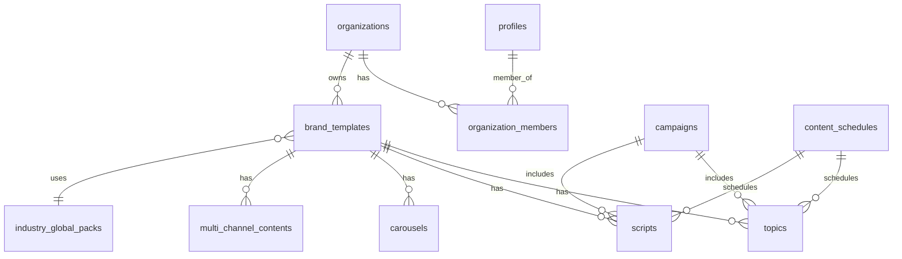

# Database Schema - Flowa

> Tài liệu về cấu trúc database và RLS policies

---

## 📋 Mục lục

1. [Tổng quan](#tổng-quan)
2. [Core Tables](#core-tables)
3. [Content Tables](#content-tables)
4. [Industry Park Tables](#industry-park-tables)
5. [Knowledge Graph Tables](#knowledge-graph-tables)
6. [Social Integration Tables](#social-integration-tables)
7. [AI & Analytics Tables](#ai--analytics-tables)
8. [RLS Policies](#rls-policies)

---

## Tổng quan

### Database Info

- **Platform**: PostgreSQL 15+ (Supabase)
- **Project ID**: `rllyipiyuptkibqinotz`
- **Extensions**: `uuid-ossp`, `pgcrypto`, `vector`

### Schema Philosophy

```
┌─────────────────────────────────────────────────────────────┐
│                    MULTI-TENANCY MODEL                       │
├─────────────────────────────────────────────────────────────┤
│  User belongs to Organization(s)                             │
│  Organization owns Brand Templates                           │
│  Brand Templates own Content (topics, scripts, etc.)         │
│  Content is isolated by organization_id                      │
└─────────────────────────────────────────────────────────────┘
```

### Key Relationships



---

## Core Tables

### `profiles`

User profiles, synced with `auth.users`.

```sql
CREATE TABLE profiles (
  id UUID PRIMARY KEY REFERENCES auth.users(id) ON DELETE CASCADE,
  email TEXT,
  full_name TEXT,
  avatar_url TEXT,
  role TEXT DEFAULT 'user',           -- user, admin, super_admin
  preferred_language TEXT DEFAULT 'vi',
  onboarding_completed BOOLEAN DEFAULT false,
  created_at TIMESTAMPTZ DEFAULT now(),
  updated_at TIMESTAMPTZ DEFAULT now()
);

-- RLS: Users can view/edit own profile
CREATE POLICY "Users can view own profile"
  ON profiles FOR SELECT
  USING (auth.uid() = id);

CREATE POLICY "Users can update own profile"
  ON profiles FOR UPDATE
  USING (auth.uid() = id);
```

### `organizations`

Multi-tenant organization container.

```sql
CREATE TABLE organizations (
  id UUID PRIMARY KEY DEFAULT gen_random_uuid(),
  name TEXT NOT NULL,
  slug TEXT UNIQUE,
  logo_url TEXT,
  settings JSONB DEFAULT '{}',
  
  -- Subscription
  plan TEXT DEFAULT 'free',           -- free, pro, enterprise
  credits_remaining INTEGER DEFAULT 100,
  
  -- Limits
  max_brands INTEGER DEFAULT 1,
  max_members INTEGER DEFAULT 3,
  
  created_at TIMESTAMPTZ DEFAULT now(),
  updated_at TIMESTAMPTZ DEFAULT now()
);
```

### `organization_members`

Organization membership with roles.

```sql
CREATE TABLE organization_members (
  id UUID PRIMARY KEY DEFAULT gen_random_uuid(),
  organization_id UUID REFERENCES organizations(id) ON DELETE CASCADE,
  user_id UUID REFERENCES profiles(id) ON DELETE CASCADE,
  role TEXT DEFAULT 'member',         -- owner, admin, member, viewer
  invited_by UUID,
  joined_at TIMESTAMPTZ DEFAULT now(),
  
  UNIQUE(organization_id, user_id)
);

-- RLS: Members can view their org's members
CREATE POLICY "Members can view org members"
  ON organization_members FOR SELECT
  USING (
    organization_id IN (
      SELECT organization_id FROM organization_members WHERE user_id = auth.uid()
    )
  );
```

### `brand_templates`

Brand configuration and voice settings.

```sql
CREATE TABLE brand_templates (
  id UUID PRIMARY KEY DEFAULT gen_random_uuid(),
  organization_id UUID REFERENCES organizations(id) ON DELETE CASCADE,
  
  name TEXT NOT NULL,
  description TEXT,
  
  -- Industry Memory link
  global_pack_id UUID REFERENCES industry_global_packs(id),
  jurisdiction_code TEXT DEFAULT 'VN',
  
  -- Brand Voice (JSONB)
  brand_voice JSONB DEFAULT '{
    "tone": [],
    "personality": [],
    "vocabulary": {
      "preferred": [],
      "forbidden": []
    }
  }',
  
  -- Visual Identity
  visual_identity JSONB DEFAULT '{
    "primaryColor": "#3b82f6",
    "secondaryColor": "#10b981",
    "logoUrl": null,
    "fontFamily": "Inter"
  }',
  
  -- Target Audience
  target_audience TEXT,
  
  -- Status
  is_active BOOLEAN DEFAULT true,
  is_default BOOLEAN DEFAULT false,
  
  created_by UUID,
  created_at TIMESTAMPTZ DEFAULT now(),
  updated_at TIMESTAMPTZ DEFAULT now()
);

-- Index for performance
CREATE INDEX idx_brand_templates_org ON brand_templates(organization_id);
CREATE INDEX idx_brand_templates_global_pack ON brand_templates(global_pack_id);
```

---

## Content Tables

### `topics`

Topic ideas and discoveries.

```sql
CREATE TABLE topics (
  id UUID PRIMARY KEY DEFAULT gen_random_uuid(),
  organization_id UUID REFERENCES organizations(id),
  brand_template_id UUID REFERENCES brand_templates(id),
  campaign_id UUID REFERENCES campaigns(id),
  
  title TEXT NOT NULL,
  description TEXT,
  
  -- Categorization
  category TEXT,                      -- educational, promotional, etc.
  intent TEXT,                        -- seed, sprout, harvest
  format TEXT,                        -- video, carousel, text
  
  -- AI Scores
  relevance_score FLOAT,
  engagement_potential FLOAT,
  compliance_score FLOAT,
  
  -- Metadata
  keywords TEXT[],
  target_personas TEXT[],
  suggested_channels TEXT[],
  
  -- Status
  status TEXT DEFAULT 'draft',        -- draft, approved, published, archived
  
  -- AI Context
  ai_suggestions JSONB,
  
  created_by UUID,
  created_at TIMESTAMPTZ DEFAULT now(),
  updated_at TIMESTAMPTZ DEFAULT now()
);

-- RLS: Org members can CRUD their topics
CREATE POLICY "Org members can manage topics"
  ON topics FOR ALL
  USING (
    organization_id IN (
      SELECT organization_id FROM organization_members WHERE user_id = auth.uid()
    )
  );
```

### `scripts`

Video scripts (60-180s).

```sql
CREATE TABLE scripts (
  id UUID PRIMARY KEY DEFAULT gen_random_uuid(),
  organization_id UUID REFERENCES organizations(id),
  brand_template_id UUID REFERENCES brand_templates(id),
  topic_id UUID REFERENCES topics(id),
  campaign_id UUID REFERENCES campaigns(id),
  
  title TEXT NOT NULL,
  
  -- Script sections
  duration TEXT,                      -- 60s, 90s, 120s, 180s
  style TEXT,                         -- educational, storytelling, promotional
  
  hook TEXT,
  problem TEXT,
  solution TEXT,
  proof TEXT,
  cta TEXT,
  
  -- Extras
  visual_cues TEXT[],
  audio_notes TEXT[],
  hashtags TEXT[],
  
  -- Full script (optional)
  full_script TEXT,
  
  -- Status
  status TEXT DEFAULT 'draft',
  compliance_score FLOAT,
  
  created_by UUID,
  created_at TIMESTAMPTZ DEFAULT now(),
  updated_at TIMESTAMPTZ DEFAULT now()
);
```

### `carousels`

Carousel content (5-10 slides).

```sql
CREATE TABLE carousels (
  id UUID PRIMARY KEY DEFAULT gen_random_uuid(),
  organization_id UUID REFERENCES organizations(id),
  brand_template_id UUID REFERENCES brand_templates(id),
  topic_id UUID REFERENCES topics(id),
  
  title TEXT NOT NULL,
  
  -- Settings
  slide_count INTEGER DEFAULT 5,
  style TEXT,                         -- minimal, bold, professional
  
  -- Slides (JSONB array)
  slides JSONB DEFAULT '[]',
  /* Each slide:
  {
    "order": 1,
    "headline": "...",
    "bodyText": "...",
    "imagePrompt": "...",
    "designNotes": "..."
  }
  */
  
  cover_slide JSONB,
  
  -- Status
  status TEXT DEFAULT 'draft',
  
  created_by UUID,
  created_at TIMESTAMPTZ DEFAULT now(),
  updated_at TIMESTAMPTZ DEFAULT now()
);
```

### `multi_channel_contents`

Multi-platform text content.

```sql
CREATE TABLE multi_channel_contents (
  id UUID PRIMARY KEY DEFAULT gen_random_uuid(),
  organization_id UUID REFERENCES organizations(id),
  brand_template_id UUID REFERENCES brand_templates(id),
  topic_id UUID REFERENCES topics(id),
  
  title TEXT NOT NULL,
  core_message TEXT,
  intent TEXT,                        -- seed, sprout, harvest
  
  -- Channel variants (JSONB)
  variants JSONB DEFAULT '{}',
  /* Structure:
  {
    "facebook": { "content": "...", "hashtags": [], "cta": "..." },
    "instagram": { ... },
    "linkedin": { ... },
    ...
  }
  */
  
  -- Approval workflow
  status TEXT DEFAULT 'draft',        -- draft, pending_review, approved, rejected
  approved_by UUID,
  approved_at TIMESTAMPTZ,
  
  created_by UUID,
  created_at TIMESTAMPTZ DEFAULT now(),
  updated_at TIMESTAMPTZ DEFAULT now()
);
```

### `campaigns`

Campaign container for content.

```sql
CREATE TABLE campaigns (
  id UUID PRIMARY KEY DEFAULT gen_random_uuid(),
  organization_id UUID REFERENCES organizations(id),
  brand_template_id UUID REFERENCES brand_templates(id),
  
  name TEXT NOT NULL,
  description TEXT,
  
  -- Goals
  objective TEXT,                     -- awareness, engagement, conversion
  target_metrics JSONB,
  
  -- Timeline
  start_date TIMESTAMPTZ,
  end_date TIMESTAMPTZ,
  
  -- Status
  status TEXT DEFAULT 'draft',        -- draft, planning, active, paused, completed
  
  -- Budget
  budget DECIMAL,
  spent DECIMAL DEFAULT 0,
  
  created_by UUID,
  created_at TIMESTAMPTZ DEFAULT now(),
  updated_at TIMESTAMPTZ DEFAULT now()
);
```

### `content_schedules`

Scheduling and publishing queue.

```sql
CREATE TABLE content_schedules (
  id UUID PRIMARY KEY DEFAULT gen_random_uuid(),
  organization_id UUID REFERENCES organizations(id),
  
  -- Content reference (polymorphic)
  content_type TEXT NOT NULL,         -- topic, script, carousel, multichannel
  content_id UUID NOT NULL,
  
  -- Schedule
  scheduled_at TIMESTAMPTZ NOT NULL,
  publish_channels TEXT[],            -- facebook, instagram, linkedin, etc.
  
  -- Status
  status TEXT DEFAULT 'scheduled',    -- scheduled, publishing, published, failed, cancelled
  
  -- Results
  published_at TIMESTAMPTZ,
  publish_results JSONB,              -- Per-channel results
  error_message TEXT,
  
  created_by UUID,
  created_at TIMESTAMPTZ DEFAULT now(),
  updated_at TIMESTAMPTZ DEFAULT now()
);

-- Index for schedule queries
CREATE INDEX idx_schedules_org_date ON content_schedules(organization_id, scheduled_at);
CREATE INDEX idx_schedules_status ON content_schedules(status) WHERE status = 'scheduled';
```

---

## Industry Park Tables

### `industry_global_packs`

Global industry definitions (source of truth).

```sql
CREATE TABLE industry_global_packs (
  id UUID PRIMARY KEY DEFAULT gen_random_uuid(),
  industry_code TEXT UNIQUE NOT NULL, -- e.g., "HEALTH_SUPPLEMENTS"
  parent_code TEXT,                   -- For sub-industries
  category_code TEXT,                 -- e.g., "healthcare"
  
  -- Base rules (global, language-agnostic)
  base_rules JSONB DEFAULT '{}',
  
  -- Compliance rules
  compliance_rules JSONB DEFAULT '{
    "forbidden_terms": [],
    "high_risk_keywords": [],
    "claim_restrictions": [],
    "required_disclaimers": []
  }',
  
  target_audience TEXT,
  
  -- Status
  is_active BOOLEAN DEFAULT true,
  version TEXT DEFAULT '1.0',
  
  created_at TIMESTAMPTZ DEFAULT now(),
  updated_at TIMESTAMPTZ DEFAULT now()
);

-- Index
CREATE INDEX idx_global_packs_code ON industry_global_packs(industry_code);
CREATE INDEX idx_global_packs_category ON industry_global_packs(category_code);
```

### `industry_pack_translations`

Multilingual translations.

```sql
CREATE TABLE industry_pack_translations (
  id UUID PRIMARY KEY DEFAULT gen_random_uuid(),
  global_pack_id UUID REFERENCES industry_global_packs(id) ON DELETE CASCADE,
  language_code TEXT NOT NULL,        -- vi, en, etc.
  
  name TEXT NOT NULL,
  description TEXT,
  
  -- Localized terminology
  glossary JSONB DEFAULT '{}',
  localized_terms JSONB DEFAULT '{
    "forbidden": [],
    "preferred": []
  }',
  
  created_at TIMESTAMPTZ DEFAULT now(),
  updated_at TIMESTAMPTZ DEFAULT now(),
  
  UNIQUE(global_pack_id, language_code)
);
```

### `industry_jurisdiction_profiles`

Pre-computed jurisdiction-specific rules.

```sql
CREATE TABLE industry_jurisdiction_profiles (
  id UUID PRIMARY KEY DEFAULT gen_random_uuid(),
  global_pack_id UUID REFERENCES industry_global_packs(id) ON DELETE CASCADE,
  jurisdiction_code TEXT NOT NULL,    -- VN, US, SG, etc.
  
  -- PRE-COMPUTED merged rules
  resolved_rules JSONB NOT NULL,
  /* Structure:
  {
    "forbidden_terms": [...],
    "high_risk_keywords": [...],
    "claim_restrictions": [...],
    "local_regulations": [...],
    "risk_weights": {...},
    "risk_thresholds": {...}
  }
  */
  
  -- Audit
  computed_at TIMESTAMPTZ DEFAULT now(),
  version TEXT DEFAULT '1.0',
  
  created_at TIMESTAMPTZ DEFAULT now(),
  updated_at TIMESTAMPTZ DEFAULT now(),
  
  UNIQUE(global_pack_id, jurisdiction_code)
);

-- Performance index
CREATE INDEX idx_jurisdiction_profiles_lookup 
  ON industry_jurisdiction_profiles(global_pack_id, jurisdiction_code);
```

---

## Knowledge Graph Tables

### `industry_knowledge_nodes`

Knowledge entities (regulations, terms, concepts).

```sql
CREATE TABLE industry_knowledge_nodes (
  id UUID PRIMARY KEY DEFAULT gen_random_uuid(),
  
  node_type TEXT NOT NULL,            -- industry, regulation, term, concept, persona, jurisdiction
  
  -- Multilingual display name
  display_name JSONB NOT NULL,        -- { "vi": "...", "en": "..." }
  description TEXT,
  
  -- Type-specific metadata
  metadata JSONB DEFAULT '{}',
  
  -- Vector embedding (384 dimensions for gte-small)
  embedding extensions.vector(384),
  
  -- Industry link
  global_pack_id UUID REFERENCES industry_global_packs(id),
  
  -- Source tracking
  source_url TEXT,
  doc_code TEXT,                      -- e.g., "40/2025/NĐ-CP"
  
  -- Quality
  content_quality_score INTEGER,
  quality_breakdown JSONB,
  
  -- Status
  is_active BOOLEAN DEFAULT true,
  
  created_at TIMESTAMPTZ DEFAULT now(),
  updated_at TIMESTAMPTZ DEFAULT now()
);

-- Indexes
CREATE INDEX idx_knowledge_nodes_type ON industry_knowledge_nodes(node_type) WHERE is_active = true;
CREATE INDEX idx_knowledge_nodes_pack ON industry_knowledge_nodes(global_pack_id);
CREATE INDEX idx_knowledge_nodes_embedding ON industry_knowledge_nodes 
  USING ivfflat (embedding vector_cosine_ops) WHERE embedding IS NOT NULL;
```

### `industry_knowledge_edges`

Relationships between nodes.

```sql
CREATE TABLE industry_knowledge_edges (
  id UUID PRIMARY KEY DEFAULT gen_random_uuid(),
  
  source_node_id UUID REFERENCES industry_knowledge_nodes(id) ON DELETE CASCADE,
  target_node_id UUID REFERENCES industry_knowledge_nodes(id) ON DELETE CASCADE,
  
  edge_type TEXT NOT NULL,            -- related_to, parent_of, regulated_by, defines, etc.
  weight FLOAT DEFAULT 1.0,
  
  metadata JSONB DEFAULT '{}',
  
  created_at TIMESTAMPTZ DEFAULT now(),
  
  UNIQUE(source_node_id, target_node_id, edge_type)
);

-- Index for traversal
CREATE INDEX idx_knowledge_edges_source ON industry_knowledge_edges(source_node_id);
CREATE INDEX idx_knowledge_edges_target ON industry_knowledge_edges(target_node_id);
```

### `regulation_sources`

External crawl sources.

```sql
CREATE TABLE regulation_sources (
  id UUID PRIMARY KEY DEFAULT gen_random_uuid(),
  
  name TEXT NOT NULL,
  domain TEXT NOT NULL,               -- vbpl.vn, vanban.chinhphu.vn, etc.
  base_url TEXT,
  
  -- Crawl config
  crawl_enabled BOOLEAN DEFAULT true,
  crawl_frequency TEXT DEFAULT 'weekly',
  last_crawled_at TIMESTAMPTZ,
  
  -- Mapping
  category_code TEXT,                 -- Maps to industry category
  jurisdiction_code TEXT DEFAULT 'VN',
  
  -- Search config
  search_config JSONB,
  
  created_at TIMESTAMPTZ DEFAULT now(),
  updated_at TIMESTAMPTZ DEFAULT now()
);
```

### `regulation_crawl_history`

Crawl audit trail.

```sql
CREATE TABLE regulation_crawl_history (
  id UUID PRIMARY KEY DEFAULT gen_random_uuid(),
  source_id UUID REFERENCES regulation_sources(id),
  
  status TEXT NOT NULL,               -- started, completed, failed
  nodes_found INTEGER DEFAULT 0,
  nodes_created INTEGER DEFAULT 0,
  nodes_updated INTEGER DEFAULT 0,
  
  duration_ms INTEGER,
  error_message TEXT,
  
  started_at TIMESTAMPTZ DEFAULT now(),
  completed_at TIMESTAMPTZ
);
```

### `regulation_propagation_log`

Change tracking for regulatory updates.

```sql
CREATE TABLE regulation_propagation_log (
  id UUID PRIMARY KEY DEFAULT gen_random_uuid(),
  
  source_node_id UUID REFERENCES industry_knowledge_nodes(id),
  
  change_type TEXT NOT NULL,          -- new, updated, replaced, expired
  
  -- Impact analysis
  impact_analysis JSONB,
  affected_industries TEXT[],
  
  -- Review
  review_status TEXT DEFAULT 'pending', -- pending, reviewed, dismissed
  reviewed_by UUID,
  reviewed_at TIMESTAMPTZ,
  
  detected_at TIMESTAMPTZ DEFAULT now()
);
```

---

## Social Integration Tables

### `social_connections`

User OAuth connections to platforms.

```sql
CREATE TABLE social_connections (
  id UUID PRIMARY KEY DEFAULT gen_random_uuid(),
  
  user_id UUID REFERENCES profiles(id) ON DELETE CASCADE,
  organization_id UUID REFERENCES organizations(id),
  
  platform TEXT NOT NULL,             -- facebook, instagram, linkedin, tiktok, twitter
  
  -- Encrypted tokens
  encrypted_access_token TEXT,
  encrypted_refresh_token TEXT,
  
  -- Token metadata
  expires_at TIMESTAMPTZ,
  scopes TEXT[],
  
  -- Platform account info
  external_user_id TEXT,
  external_username TEXT,
  page_id TEXT,                       -- For FB pages
  page_name TEXT,
  
  -- Status
  is_active BOOLEAN DEFAULT true,
  last_used_at TIMESTAMPTZ,
  
  created_at TIMESTAMPTZ DEFAULT now(),
  updated_at TIMESTAMPTZ DEFAULT now()
);

-- RLS: Users can only see their own connections
CREATE POLICY "Users can manage own connections"
  ON social_connections FOR ALL
  USING (user_id = auth.uid());
```

### `social_platform_settings`

Global platform app credentials (admin-only).

```sql
CREATE TABLE social_platform_settings (
  id UUID PRIMARY KEY DEFAULT gen_random_uuid(),
  
  platform TEXT UNIQUE NOT NULL,
  
  -- Encrypted credentials
  encrypted_app_id TEXT,
  encrypted_app_secret TEXT,
  
  -- Config
  redirect_uri TEXT,
  scopes TEXT[],
  
  is_enabled BOOLEAN DEFAULT false,
  
  updated_by UUID,
  updated_at TIMESTAMPTZ DEFAULT now()
);

-- RLS: Admin only
CREATE POLICY "Admin can manage platform settings"
  ON social_platform_settings FOR ALL
  USING (
    EXISTS (
      SELECT 1 FROM profiles WHERE id = auth.uid() AND role = 'admin'
    )
  );
```

### `publishing_logs`

Publishing audit trail.

```sql
CREATE TABLE publishing_logs (
  id UUID PRIMARY KEY DEFAULT gen_random_uuid(),
  
  organization_id UUID REFERENCES organizations(id),
  connection_id UUID REFERENCES social_connections(id),
  schedule_id UUID REFERENCES content_schedules(id),
  
  platform TEXT NOT NULL,
  
  -- Content reference
  content_type TEXT,
  content_id UUID,
  
  -- Result
  status TEXT NOT NULL,               -- success, failed, pending
  external_post_id TEXT,
  external_post_url TEXT,
  
  error_code TEXT,
  error_message TEXT,
  
  -- Metrics
  published_at TIMESTAMPTZ DEFAULT now(),
  
  raw_response JSONB
);
```

---

## AI & Analytics Tables

### `ai_metrics`

AI call tracking and metrics.

```sql
CREATE TABLE ai_metrics (
  id UUID PRIMARY KEY DEFAULT gen_random_uuid(),
  
  trace_id TEXT NOT NULL,
  function_name TEXT NOT NULL,
  
  -- Performance
  total_duration_ms INTEGER NOT NULL,
  ai_call_duration_ms INTEGER,
  context_fetch_duration_ms INTEGER,
  
  -- Tokens
  input_tokens_estimated INTEGER,
  output_tokens_estimated INTEGER,
  estimated_cost_usd DECIMAL,
  
  -- Model info
  models_used JSONB,
  quality_mode TEXT,
  
  -- Cache
  cache_hit BOOLEAN DEFAULT false,
  
  -- Error tracking
  had_error BOOLEAN DEFAULT false,
  error_type TEXT,
  error_message TEXT,
  
  -- Context
  organization_id UUID,
  brand_template_id UUID,
  user_id UUID,
  
  created_at TIMESTAMPTZ DEFAULT now()
);

-- Index for analytics
CREATE INDEX idx_ai_metrics_org_date ON ai_metrics(organization_id, created_at);
CREATE INDEX idx_ai_metrics_function ON ai_metrics(function_name);
```

### `knowledge_graph_analytics`

Query performance tracking.

```sql
CREATE TABLE knowledge_graph_analytics (
  id UUID PRIMARY KEY DEFAULT gen_random_uuid(),
  
  query_type TEXT NOT NULL,           -- semantic_search, traverse, health_check
  query_params JSONB,
  
  result_count INTEGER,
  duration_ms INTEGER,
  
  user_id UUID,
  
  created_at TIMESTAMPTZ DEFAULT now()
);
```

### `batch_processing_jobs`

Batch operation tracking.

```sql
CREATE TABLE batch_processing_jobs (
  id UUID PRIMARY KEY DEFAULT gen_random_uuid(),
  
  organization_id UUID,
  
  job_type TEXT NOT NULL,             -- embedding, parse, crawl, export
  
  -- Progress
  status TEXT DEFAULT 'pending',      -- pending, processing, completed, failed
  progress INTEGER DEFAULT 0,
  
  total_items INTEGER DEFAULT 0,
  processed_items INTEGER DEFAULT 0,
  failed_items INTEGER DEFAULT 0,
  
  -- Current item
  current_item_id TEXT,
  current_item_name TEXT,
  
  -- Config
  config JSONB,
  
  -- Results
  error_log JSONB,
  
  -- Timing
  started_at TIMESTAMPTZ,
  completed_at TIMESTAMPTZ,
  estimated_completion TIMESTAMPTZ,
  
  created_by UUID,
  created_at TIMESTAMPTZ DEFAULT now(),
  updated_at TIMESTAMPTZ DEFAULT now()
);
```

---

## RLS Policies

### Common Patterns

#### 1. Organization Isolation

```sql
-- Pattern: Only org members can access
CREATE POLICY "Org members can access"
  ON table_name FOR ALL
  USING (
    organization_id IN (
      SELECT organization_id 
      FROM organization_members 
      WHERE user_id = auth.uid()
    )
  );
```

#### 2. Owner Only

```sql
-- Pattern: Only record owner can access
CREATE POLICY "Owner only"
  ON table_name FOR ALL
  USING (user_id = auth.uid());
```

#### 3. Admin Only

```sql
-- Pattern: Only admins can access
CREATE POLICY "Admin only"
  ON table_name FOR ALL
  USING (
    EXISTS (
      SELECT 1 FROM profiles 
      WHERE id = auth.uid() AND role = 'admin'
    )
  );
```

#### 4. Public Read

```sql
-- Pattern: Anyone can read, only org can write
CREATE POLICY "Public read"
  ON table_name FOR SELECT
  USING (true);

CREATE POLICY "Org members can write"
  ON table_name FOR INSERT UPDATE DELETE
  USING (
    organization_id IN (
      SELECT organization_id 
      FROM organization_members 
      WHERE user_id = auth.uid()
    )
  );
```

### RLS Summary by Table

| Table | Policy |
|-------|--------|
| profiles | Owner only |
| organizations | Member access |
| organization_members | Org isolation |
| brand_templates | Org isolation |
| topics, scripts, carousels | Org isolation |
| multi_channel_contents | Org isolation |
| campaigns | Org isolation |
| content_schedules | Org isolation |
| social_connections | Owner only |
| social_platform_settings | Admin only |
| industry_global_packs | Public read |
| industry_pack_translations | Public read |
| industry_jurisdiction_profiles | Public read |
| industry_knowledge_nodes | Public read |
| industry_knowledge_edges | Public read |

---

## Migrations

### Location

Migrations are stored in `supabase/migrations/` and auto-applied.

### Naming Convention

```
20240115000000_description_of_change.sql
```

### Creating Migrations

Use the database migration tool in Lovable - never edit migration files directly.

---

## Related Documentation

- [INDUSTRY-PARK.md](./INDUSTRY-PARK.md) - Industry Park tables detail
- [KNOWLEDGE-GRAPH.md](./KNOWLEDGE-GRAPH.md) - Knowledge Graph tables detail
- [EDGE-FUNCTIONS.md](./EDGE-FUNCTIONS.md) - Functions that interact with database
