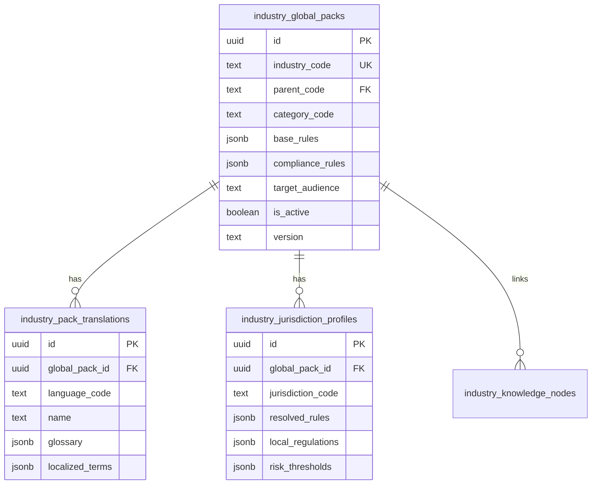
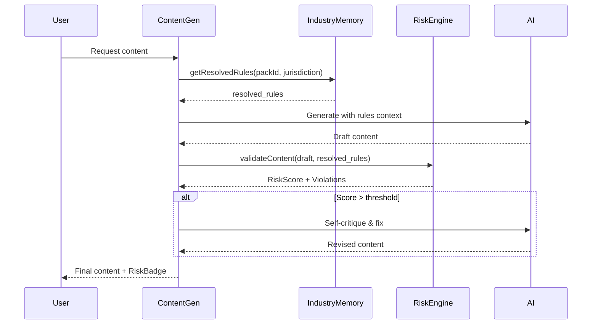

# Industry Park - Industry Memory System

> Hệ thống quản lý quy định ngành và compliance cho nội dung AI

---

## 📋 Mục lục

1. [Tổng quan](#tổng-quan)
2. [Architecture v2.1](#architecture-v21)
3. [Data Flow](#data-flow)
4. [Risk Scoring Engine](#risk-scoring-engine)
5. [Admin Management](#admin-management)
6. [Integration Guide](#integration-guide)

---

## Tổng quan

### Industry Memory là gì?

Industry Memory là **lớp governance** của Flowa, đảm bảo mọi nội dung AI-generated tuân thủ quy định ngành. Đây là **strategic moat** - điểm khác biệt cạnh tranh của nền tảng.

### Nguyên tắc Core

```
┌─────────────────────────────────────────────────────────────┐
│                    PRIORITY CASCADE                          │
├─────────────────────────────────────────────────────────────┤
│  🔒 Industry Memory (Immutable)                              │
│     - Quy định pháp luật                                     │
│     - Từ ngữ cấm                                             │
│     - Claim restrictions                                     │
│                         ↓                                    │
│  🎨 Brand Voice (Customizable but bounded)                   │
│     - Giọng điệu thương hiệu                                 │
│     - Từ ngữ ưa thích                                        │
│                         ↓                                    │
│  📱 Channel Rules                                            │
│     - Format theo platform                                   │
│     - Character limits                                       │
│                         ↓                                    │
│  ⚙️  System Defaults                                         │
│     - Fallback behavior                                      │
└─────────────────────────────────────────────────────────────┘
```

### Số liệu thống kê (v2.2)

| Metric | Value |
|--------|-------|
| Total Global Packs | 463 |
| Core Industries | 104 |
| Sub Industries | 359 |
| Categories | 18 |
| VN Translation Coverage | 100% |
| VN Jurisdiction Profiles | 100% |
| US/SG Profiles | ~60% |

---

## Architecture v2.1

### Core Tables



### 1. `industry_global_packs` - Source of Truth

```typescript
interface GlobalPack {
  id: string;
  industry_code: string;      // e.g., "HEALTH_SUPPLEMENTS"
  parent_code: string | null; // For sub-industries
  category_code: string;      // e.g., "healthcare"
  
  // Base rules (global, language-agnostic)
  base_rules: {
    brand_voice_guidelines: string[];
    content_principles: string[];
    claim_categories: string[];
  };
  
  // Compliance rules
  compliance_rules: {
    forbidden_terms: string[];          // Từ cấm tuyệt đối
    high_risk_keywords: string[];       // Từ cần cảnh báo
    claim_restrictions: ClaimRule[];    // Quy tắc claim
    required_disclaimers: string[];     // Disclaimer bắt buộc
  };
  
  target_audience: string;
  is_active: boolean;
  version: string;
}
```

### 2. `industry_pack_translations` - Multilingual

```typescript
interface PackTranslation {
  id: string;
  global_pack_id: string;
  language_code: string;      // 'vi', 'en'
  
  name: string;               // Localized name
  description: string;
  
  glossary: {
    [term: string]: {
      definition: string;
      context: string;
      approved_alternatives: string[];
    };
  };
  
  localized_terms: {
    forbidden: string[];      // Localized forbidden terms
    preferred: string[];      // Localized preferred terms
  };
}
```

### 3. `industry_jurisdiction_profiles` - Pre-computed Rules

```typescript
interface JurisdictionProfile {
  id: string;
  global_pack_id: string;
  jurisdiction_code: string;  // 'VN', 'US', 'SG'
  
  // PRE-COMPUTED - Ready for AI consumption
  resolved_rules: {
    // Merged from global + local
    forbidden_terms: string[];
    high_risk_keywords: string[];
    claim_restrictions: ClaimRule[];
    
    // Local additions
    local_regulations: Regulation[];
    local_disclaimers: string[];
    
    // Scoring config
    risk_weights: Record<string, number>;
    risk_thresholds: {
      low: number;
      medium: number;
      high: number;
    };
  };
  
  // Audit
  computed_at: string;
  version: string;
}
```

### Tại sao Pre-computed?

```
┌─────────────────────────────────────────────────────────────┐
│  RUNTIME (mỗi lần generate content)                         │
├─────────────────────────────────────────────────────────────┤
│  ❌ Without pre-compute:                                     │
│     1. Fetch global_pack                                     │
│     2. Fetch translations                                    │
│     3. Fetch local regulations                               │
│     4. Merge rules                                           │
│     5. Apply overrides                                       │
│     → 5 queries + complex logic = SLOW                       │
│                                                              │
│  ✅ With pre-compute (resolved_rules):                       │
│     1. Fetch jurisdiction_profile                            │
│     → 1 query = FAST                                         │
└─────────────────────────────────────────────────────────────┘
```

---

## Data Flow

### Content Generation Flow



### Rule Resolution Algorithm

```typescript
// src/hooks/useIndustryMemory.ts

async function resolveRules(
  globalPackId: string,
  jurisdictionCode: string
): Promise<ResolvedRules> {
  
  // 1. Try v2.1 pre-computed rules first
  const { data: profile } = await supabase
    .from('industry_jurisdiction_profiles')
    .select('resolved_rules')
    .eq('global_pack_id', globalPackId)
    .eq('jurisdiction_code', jurisdictionCode)
    .single();
  
  if (profile?.resolved_rules) {
    return profile.resolved_rules;
  }
  
  // 2. Fallback: Compute on-the-fly
  const globalPack = await fetchGlobalPack(globalPackId);
  const translations = await fetchTranslations(globalPackId, 'vi');
  
  return {
    forbidden_terms: [
      ...globalPack.compliance_rules.forbidden_terms,
      ...translations.localized_terms.forbidden,
    ],
    high_risk_keywords: globalPack.compliance_rules.high_risk_keywords,
    claim_restrictions: globalPack.compliance_rules.claim_restrictions,
    // ... merge more rules
  };
}
```

---

## Risk Scoring Engine

### Scoring Algorithm

```typescript
// supabase/functions/_shared/risk-scoring.ts

interface RiskScore {
  overall: number;           // 0-100
  level: 'low' | 'medium' | 'high' | 'critical';
  
  breakdown: {
    forbidden_terms: number;
    high_risk_keywords: number;
    claim_violations: number;
    pattern_matches: number;
  };
  
  violations: Violation[];
}

function calculateRiskScore(
  content: string,
  resolvedRules: ResolvedRules
): RiskScore {
  let score = 0;
  const violations: Violation[] = [];
  const weights = resolvedRules.risk_weights;
  
  // 1. Check forbidden terms (highest weight)
  for (const term of resolvedRules.forbidden_terms) {
    if (content.toLowerCase().includes(term.toLowerCase())) {
      score += weights.forbidden_term || 30;
      violations.push({
        type: 'forbidden_term',
        term,
        severity: 'critical',
        suggestion: `Xóa hoặc thay thế "${term}"`,
      });
    }
  }
  
  // 2. Check high-risk keywords
  for (const keyword of resolvedRules.high_risk_keywords) {
    if (content.toLowerCase().includes(keyword.toLowerCase())) {
      score += weights.high_risk_keyword || 15;
      violations.push({
        type: 'high_risk_keyword',
        term: keyword,
        severity: 'warning',
        suggestion: `Cân nhắc ngữ cảnh sử dụng "${keyword}"`,
      });
    }
  }
  
  // 3. Check claim patterns
  for (const rule of resolvedRules.claim_restrictions) {
    const matches = content.match(new RegExp(rule.pattern, 'gi'));
    if (matches) {
      score += (weights.claim_violation || 20) * matches.length;
      violations.push({
        type: 'claim_violation',
        term: matches[0],
        severity: 'error',
        suggestion: rule.suggestion,
        regulation: rule.regulation_reference,
      });
    }
  }
  
  // 4. Determine level
  const thresholds = resolvedRules.risk_thresholds;
  let level: RiskScore['level'] = 'low';
  if (score >= thresholds.critical || 100) level = 'critical';
  else if (score >= thresholds.high || 70) level = 'high';
  else if (score >= thresholds.medium || 40) level = 'medium';
  
  return { overall: Math.min(score, 100), level, breakdown: {...}, violations };
}
```

### Risk Thresholds by Industry

| Industry | Low | Medium | High | Critical |
|----------|-----|--------|------|----------|
| Healthcare | <20 | 20-40 | 40-60 | >60 |
| Finance | <25 | 25-45 | 45-65 | >65 |
| Education | <30 | 30-50 | 50-70 | >70 |
| E-commerce | <40 | 40-60 | 60-80 | >80 |

---

## Admin Management

### Admin Routes

```
/admin/industries           # Industry Pack management
/admin/knowledge-graph      # Knowledge Graph explorer
```

### `/admin/industries` Features

```
┌─────────────────────────────────────────────────────────────┐
│  INDUSTRY PACK ADMIN                                         │
├─────────────────────────────────────────────────────────────┤
│  [Sidebar: Categories]                                       │
│  - Healthcare (23)                                           │
│  - Finance (18)                                              │
│  - Education (15)                                            │
│  - ...                                                       │
│                                                              │
│  [Main Area]                                                 │
│  ┌─────────────────────────────────────────────────────────┐│
│  │ Filter: [Core ▼] [Sub ▼]   View: [Grid] [List] [Tree]  ││
│  │                                                          ││
│  │ ┌─────────┐ ┌─────────┐ ┌─────────┐                     ││
│  │ │ Pack 1  │ │ Pack 2  │ │ Pack 3  │                     ││
│  │ │ VN ✓    │ │ VN ✓    │ │ VN ✓    │                     ││
│  │ │ 45 nodes│ │ 23 nodes│ │ 0 nodes │                     ││
│  │ └─────────┘ └─────────┘ └─────────┘                     ││
│  └─────────────────────────────────────────────────────────┘│
└─────────────────────────────────────────────────────────────┘
```

### Export/Import

```typescript
// Export single pack to Excel (9 sheets)
async function exportPackToExcel(packId: string) {
  const sheets = [
    'basic_info',
    'translations',
    'compliance_rules',
    'forbidden_terms',
    'high_risk_keywords',
    'claim_restrictions',
    'personas',
    'knowledge_nodes',
    'jurisdiction_profiles',
  ];
  
  // Generate XLSX with all sheets
  return generateExcelWorkbook(packId, sheets);
}
```

---

## Integration Guide

### 1. Sử dụng trong Component

```typescript
// Get industry memory for brand
import { useIndustryMemory } from '@/hooks/useIndustryMemory';

function ContentGenerator({ brandTemplateId }: Props) {
  const { data: brand } = useBrandTemplate(brandTemplateId);
  
  const { 
    data: industryMemory,
    isLoading,
  } = useIndustryMemory(
    brand?.global_pack_id,
    brand?.jurisdiction_code || 'VN'
  );
  
  // Use in content generation
  const handleGenerate = async () => {
    const result = await generateContent({
      topic,
      industryRules: industryMemory?.resolved_rules,
    });
  };
}
```

### 2. Sử dụng trong Edge Function

```typescript
// supabase/functions/generate-script/index.ts
import { buildIndustryContextV2 } from '../_shared/context-builders/industry-context-v2.ts';

async function generateScript(request: ScriptRequest) {
  // 1. Fetch resolved rules
  const { data: profile } = await supabase
    .from('industry_jurisdiction_profiles')
    .select('resolved_rules')
    .eq('global_pack_id', request.globalPackId)
    .eq('jurisdiction_code', request.jurisdiction)
    .single();
  
  // 2. Build context for AI
  const industryContext = buildIndustryContextV2(profile?.resolved_rules);
  
  // 3. Include in system prompt
  const systemPrompt = `
    ${SCRIPT_GENERATION_PROMPT}
    
    ${industryContext}
  `;
  
  // 4. Generate with compliance
  return await callAI(systemPrompt, request.userPrompt);
}
```

### 3. Risk Badge Component

```tsx
import { ComplianceRiskBadgeV2 } from '@/components/industry/ComplianceRiskBadgeV2';

function ContentPreview({ content, riskScore }: Props) {
  return (
    <div>
      <div className="flex items-center gap-2">
        <h3>Preview</h3>
        <ComplianceRiskBadgeV2 
          score={riskScore.overall}
          level={riskScore.level}
          violations={riskScore.violations}
        />
      </div>
      <div className="mt-4">{content}</div>
    </div>
  );
}
```

---

## Key Design Decisions

### 1. Tại sao Industry Rules là Immutable?

- **Compliance**: Quy định pháp luật không thể bị ghi đè
- **Consistency**: Mọi user trong ngành tuân thủ cùng rules
- **Audit**: Dễ trace khi có vấn đề compliance

### 2. Tại sao Pre-computed Profiles?

- **Performance**: 1 query thay vì 5+
- **Reliability**: Không lỗi runtime merge
- **Versioning**: Snapshot rules tại thời điểm compute

### 3. Tại sao Jurisdiction-based?

- **Localization**: Quy định khác nhau theo quốc gia
- **Scalability**: Thêm country mà không ảnh hưởng global
- **Precision**: Tuân thủ chính xác từng thị trường

---

## Troubleshooting

### Common Issues

| Issue | Cause | Solution |
|-------|-------|----------|
| Rules not loading | Missing jurisdiction profile | Trigger profile regeneration |
| Outdated rules | Profile not re-computed | Run `regenerate-jurisdiction-profile` |
| Missing translations | Translation not added | Add via admin UI |
| High false-positive risk | Overly strict keywords | Review `high_risk_keywords` list |

### Debug Commands

```typescript
// Check if profile exists
const { data } = await supabase
  .from('industry_jurisdiction_profiles')
  .select('*')
  .eq('global_pack_id', packId)
  .eq('jurisdiction_code', 'VN');

console.log('Profile:', data);

// Force re-compute
await supabase.functions.invoke('regenerate-jurisdiction-profile', {
  body: { globalPackId: packId, jurisdiction: 'VN' },
});
```

---

## Related Documentation

- [KNOWLEDGE-GRAPH.md](./KNOWLEDGE-GRAPH.md) - Knowledge Graph linked to Industry Packs
- [ARCHITECTURE.md](./ARCHITECTURE.md) - Full v2.1 Architecture Spec
- [EDGE-FUNCTIONS.md](./EDGE-FUNCTIONS.md) - Backend functions for Industry Memory
