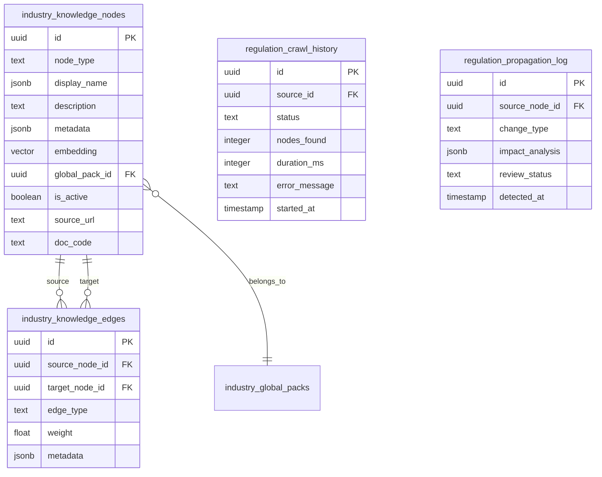
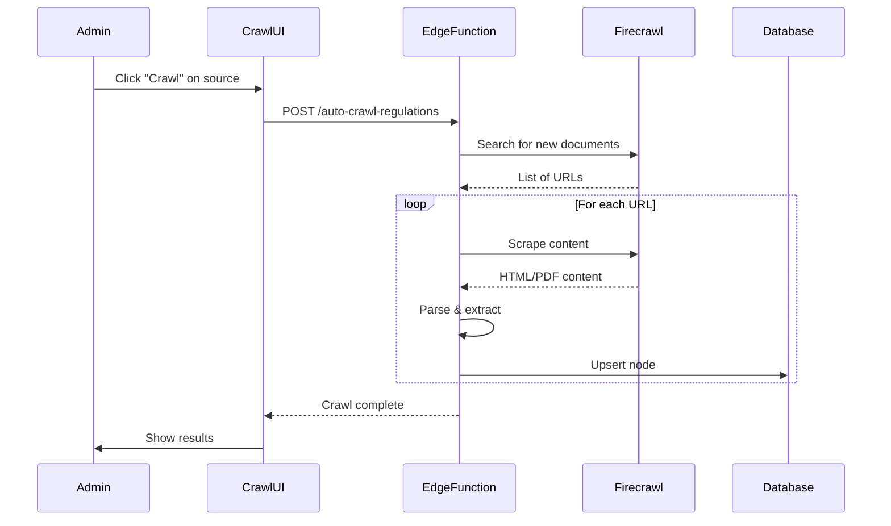

# Knowledge Graph System

> Hệ thống đồ thị tri thức cho regulatory compliance và content intelligence

---

## 📋 Mục lục

1. [Tổng quan](#tổng-quan)
2. [Architecture](#architecture)
3. [Node & Edge Types](#node--edge-types)
4. [Embedding System](#embedding-system)
5. [External Crawl System](#external-crawl-system)
6. [Admin UI](#admin-ui)
7. [Integration Guide](#integration-guide)

---

## Tổng quan

### Knowledge Graph là gì?

Knowledge Graph là hệ thống lưu trữ và liên kết các thực thể tri thức ngành (quy định, thuật ngữ, personas, concepts) để:

1. **Enrich AI Context**: Cung cấp context chính xác cho content generation
2. **Semantic Search**: Tìm kiếm theo ý nghĩa, không chỉ keyword
3. **Regulatory Tracking**: Theo dõi thay đổi quy định pháp luật
4. **Relationship Discovery**: Khám phá mối quan hệ giữa các thực thể

### Số liệu thống kê

| Metric | Value |
|--------|-------|
| Total Nodes | 760+ |
| Node Types | 6 |
| Edge Types | 8 |
| Embedding Dimensions | 384 |
| Embedding Model | gte-small (Supabase AI) |

---

## Architecture

### Core Tables



### Node Schema

```typescript
interface KnowledgeNode {
  id: string;
  node_type: NodeType;
  
  // Display (multilingual)
  display_name: {
    vi: string;
    en: string;
  };
  
  description: string;
  
  // Metadata varies by type
  metadata: NodeMetadata;
  
  // Vector embedding (384d)
  embedding: number[] | null;
  
  // Industry link
  global_pack_id: string | null;
  
  // Source tracking
  source_url: string | null;
  doc_code: string | null;      // e.g., "40/2025/NĐ-CP"
  
  // Status
  is_active: boolean;
  created_at: string;
  updated_at: string;
}
```

---

## Node & Edge Types

### Node Types

| Type | Description | Example |
|------|-------------|---------|
| `industry` | Ngành nghề | Healthcare, Finance |
| `regulation` | Văn bản pháp luật | Nghị định 40/2025/NĐ-CP |
| `term` | Thuật ngữ chuyên ngành | "Thực phẩm chức năng" |
| `concept` | Khái niệm | "Compliance", "Risk" |
| `persona` | Đối tượng khách hàng | "SME Owner", "Marketer" |
| `jurisdiction` | Khu vực pháp lý | Vietnam, US, Singapore |

### Node Metadata by Type

```typescript
// Regulation node
interface RegulationMetadata {
  doc_code: string;           // "40/2025/NĐ-CP"
  doc_number: string;         // "40"
  doc_year: number;           // 2025
  issuing_body: string;       // "Chính phủ"
  effective_date: string;
  expiry_date?: string;
  category_code: string;      // Maps to industry
  priority: number;           // 1-5
  full_text?: string;         // Extracted content
  content_quality_score?: number;
}

// Term node
interface TermMetadata {
  definition: string;
  context: string;
  approved_alternatives: string[];
  forbidden_variants: string[];
  usage_examples: string[];
}

// Persona node
interface PersonaMetadata {
  demographics: {
    age_range: string;
    income_level: string;
    education: string;
  };
  pain_points: string[];
  goals: string[];
  preferred_channels: string[];
}
```

### Edge Types

| Type | Description | Example |
|------|-------------|---------|
| `related_to` | Liên quan chung | Term ↔ Term |
| `parent_of` | Quan hệ cha-con | Industry → Sub-industry |
| `regulated_by` | Được điều chỉnh bởi | Industry ↔ Regulation |
| `defines` | Định nghĩa | Regulation → Term |
| `applies_to` | Áp dụng cho | Regulation → Persona |
| `replaces` | Thay thế | New Regulation → Old Regulation |
| `amends` | Sửa đổi | Amendment → Original |
| `references` | Tham chiếu | Regulation → Regulation |

---

## Embedding System

### Model: gte-small (Supabase AI)

```typescript
// 384-dimensional embeddings
// No external API required - runs locally

// supabase/functions/_shared/embedding-generator.ts
import { Supabase } from 'https://esm.sh/@anthropic-ai/sdk';

async function generateEmbedding(text: string): Promise<number[]> {
  const session = new Supabase.ai.Session('gte-small');
  const embedding = await session.run(text, {
    mean_pool: true,
    normalize: true,
  });
  return Array.from(embedding);
}
```

### Batch Embedding Generation

```typescript
// supabase/functions/batch-generate-embeddings/index.ts

// Process in batches of 5 to avoid timeouts
const BATCH_SIZE = 5;

async function batchGenerateEmbeddings(nodeIds?: string[]) {
  // 1. Fetch nodes without embeddings
  const { data: nodes } = await supabase
    .from('industry_knowledge_nodes')
    .select('id, display_name, description')
    .is('embedding', null)
    .eq('is_active', true)
    .limit(BATCH_SIZE);
  
  // 2. Generate embeddings
  for (const node of nodes) {
    const text = `${node.display_name.vi || ''} ${node.description || ''}`;
    const embedding = await generateEmbedding(text);
    
    // 3. Update node
    await supabase
      .from('industry_knowledge_nodes')
      .update({ embedding })
      .eq('id', node.id);
  }
  
  return { processed: nodes.length };
}
```

### Semantic Search

```typescript
// supabase/functions/semantic-search/index.ts

interface SearchResult {
  id: string;
  display_name: { vi: string; en: string };
  node_type: string;
  similarity: number;
}

async function semanticSearch(
  query: string,
  options: {
    limit?: number;
    threshold?: number;
    nodeTypes?: string[];
    globalPackId?: string;
  }
): Promise<SearchResult[]> {
  // 1. Generate query embedding
  const queryEmbedding = await generateEmbedding(query);
  
  // 2. Call RPC for vector similarity
  const { data } = await supabase.rpc('search_knowledge_nodes', {
    p_query_embedding: queryEmbedding,
    p_limit: options.limit || 10,
    p_threshold: options.threshold || 0.5,
    p_node_types: options.nodeTypes,
    p_global_pack_id: options.globalPackId,
  });
  
  return data;
}
```

### RPC Function

```sql
-- search_knowledge_nodes
CREATE OR REPLACE FUNCTION search_knowledge_nodes(
  p_query_embedding extensions.vector(384),
  p_limit INTEGER DEFAULT 10,
  p_threshold FLOAT DEFAULT 0.5,
  p_node_types TEXT[] DEFAULT NULL,
  p_global_pack_id UUID DEFAULT NULL
)
RETURNS TABLE (
  id UUID,
  display_name JSONB,
  node_type TEXT,
  description TEXT,
  similarity FLOAT
)
LANGUAGE plpgsql
SET search_path TO public, extensions
AS $$
BEGIN
  RETURN QUERY
  SELECT 
    n.id,
    n.display_name,
    n.node_type,
    n.description,
    1 - (n.embedding <=> p_query_embedding) AS similarity
  FROM industry_knowledge_nodes n
  WHERE 
    n.is_active = true
    AND n.embedding IS NOT NULL
    AND (p_node_types IS NULL OR n.node_type = ANY(p_node_types))
    AND (p_global_pack_id IS NULL OR n.global_pack_id = p_global_pack_id)
    AND 1 - (n.embedding <=> p_query_embedding) >= p_threshold
  ORDER BY n.embedding <=> p_query_embedding
  LIMIT p_limit;
END;
$$;
```

---

## External Crawl System

### Supported Sources

| Source | Domain | Category | Priority |
|--------|--------|----------|----------|
| VBPL.vn | vbpl.vn | VN Legal | High |
| Chính phủ | vanban.chinhphu.vn | VN Legal | High |
| Thư viện PL | thuvienphapluat.vn | VN Legal | Medium |
| LuatVietnam | luatvietnam.vn | VN Legal | Medium |
| EUR-Lex | eur-lex.europa.eu | EU Legal | Medium |
| SEC.gov | sec.gov | US Finance | Medium |

### Crawl Flow



### Document Extraction Pipeline

```typescript
// Multi-strategy extraction

async function extractRegulationContent(url: string): Promise<string> {
  // Strategy 1: Direct PDF/DOC download
  const directUrl = convertToDirectDownload(url);
  if (directUrl) {
    const content = await downloadAndParse(directUrl);
    if (content) return content;
  }
  
  // Strategy 2: TVPL fallback
  const tvplContent = await searchTVPL(url);
  if (tvplContent) return tvplContent;
  
  // Strategy 3: AI extraction from HTML
  const html = await fetchHTML(url);
  const aiContent = await extractWithAI(html);
  if (aiContent) return aiContent;
  
  throw new Error('All extraction strategies failed');
}
```

### Content Quality Scoring

```typescript
interface QualityBreakdown {
  has_full_text: boolean;
  artifact_score: number;      // 0-100, lower is better
  structure_score: number;     // 0-100, higher is better
  completeness_score: number;  // 0-100
}

function calculateQualityScore(content: string): number {
  const artifacts = countArtifacts(content);    // HTML tags, navigation text
  const structure = analyzeStructure(content);  // Chapters, articles
  const length = content.length;
  
  let score = 100;
  score -= artifacts * 2;           // Penalty for artifacts
  score += structure.chapters * 5;  // Bonus for structure
  score = Math.max(0, Math.min(100, score));
  
  return score;
}
```

---

## Admin UI

### Tab Structure

```
/admin/knowledge-graph
├── Khám phá (Explorer)
│   ├── List View         # Searchable node list
│   ├── Graph View        # Interactive visualization
│   └── Semantic Search   # Vector similarity search
│
├── Nguồn & Crawl (Sources)
│   ├── Sources Panel     # Manage crawl sources
│   └── Crawl Viewer      # View crawled content
│
├── Xử lý (Processing)
│   ├── Parse Queue       # Document parsing
│   ├── Embeddings        # Embedding generation
│   └── Entity Extract    # AI entity extraction
│
├── Phân tích (Analytics)
│   ├── Health Dashboard  # Graph health metrics
│   ├── Coverage Report   # Embedding coverage
│   └── Query Performance # Search performance
│
├── AI Gợi ý (Suggestions)
│   └── Connection Suggestions  # AI-powered relationship discovery
│
└── Công cụ (Tools)
    ├── Import/Export     # Bulk data management
    ├── Propagation       # Regulation updates
    └── Deduplication     # Duplicate detection
```

### Key Components

```
src/components/admin/knowledge-graph/
├── KnowledgeGraphPage.tsx          # Main page
├── UnifiedExplorerTab.tsx          # Explorer tab
├── UnifiedProcessingTab.tsx        # Processing tab
├── UnifiedToolsTab.tsx             # Tools tab
│
├── KnowledgeGraphViewer.tsx        # List view
├── GraphCanvas.tsx                 # D3 visualization
├── SemanticSearchPanel.tsx         # Search interface
│
├── RegulationSourcesPanel.tsx      # Crawl sources
├── CrawledContentViewer.tsx        # Crawl results
├── CrawledNodeCard.tsx             # Node card
├── CrawledNodeDetailSheet.tsx      # Detail modal
│
├── EmbeddingsPanel.tsx             # Embedding management
├── BatchProcessingPanel.tsx        # Batch operations
├── DuplicateDetectionPanel.tsx     # Duplicate finder
│
└── IndustryKnowledgeExplorer.tsx   # Pack-specific explorer
```

### Graph Visualization

```typescript
// src/components/admin/knowledge-graph/GraphCanvas.tsx
// Uses react-force-graph-2d

interface GraphData {
  nodes: Array<{
    id: string;
    name: string;
    type: string;
    color: string;
    size: number;
  }>;
  links: Array<{
    source: string;
    target: string;
    type: string;
    weight: number;
  }>;
}

function GraphCanvas({ data, onNodeClick, highlightNodeId }: Props) {
  const graphRef = useRef();
  
  // Node coloring by type
  const getNodeColor = (node: Node) => {
    const colors = {
      regulation: '#ef4444',  // red
      term: '#3b82f6',        // blue
      concept: '#10b981',     // green
      persona: '#8b5cf6',     // purple
      industry: '#f59e0b',    // amber
      jurisdiction: '#6b7280', // gray
    };
    return colors[node.type] || '#9ca3af';
  };
  
  return (
    <ForceGraph2D
      ref={graphRef}
      graphData={data}
      nodeColor={getNodeColor}
      nodeRelSize={6}
      linkWidth={link => link.weight * 2}
      onNodeClick={onNodeClick}
      // ... more props
    />
  );
}
```

---

## Integration Guide

### 1. Semantic Search in Content Generation

```typescript
// Hook for semantic search
import { useSemanticSearch } from '@/hooks/useSemanticSearch';

function ContentEnhancer({ topic }: Props) {
  const { search, results, isSearching } = useSemanticSearch();
  
  useEffect(() => {
    // Find related regulations and terms
    search(topic, {
      nodeTypes: ['regulation', 'term'],
      limit: 5,
      threshold: 0.6,
    });
  }, [topic]);
  
  return (
    <div>
      <h3>Related Knowledge</h3>
      {results.map(node => (
        <Badge key={node.id}>
          {node.display_name.vi}
          <span className="opacity-60">
            {Math.round(node.similarity * 100)}%
          </span>
        </Badge>
      ))}
    </div>
  );
}
```

### 2. RAG Context Building

```typescript
// supabase/functions/_shared/rag-fetcher.ts

async function buildRAGContext(
  query: string,
  globalPackId: string
): Promise<string> {
  // 1. Semantic search
  const nodes = await semanticSearch(query, {
    globalPackId,
    limit: 5,
    threshold: 0.5,
  });
  
  // 2. Build context string
  const context = nodes.map(node => {
    if (node.node_type === 'regulation') {
      return `
        [Quy định: ${node.display_name.vi}]
        Mã văn bản: ${node.metadata.doc_code}
        Nội dung: ${node.metadata.full_text?.slice(0, 500)}...
      `;
    }
    if (node.node_type === 'term') {
      return `
        [Thuật ngữ: ${node.display_name.vi}]
        Định nghĩa: ${node.metadata.definition}
      `;
    }
    return '';
  }).join('\n\n');
  
  return context;
}
```

### 3. Relationship Discovery

```typescript
// supabase/functions/suggest-connections/index.ts

async function suggestConnections(nodeId: string) {
  // 1. Get source node
  const sourceNode = await getNode(nodeId);
  
  // 2. Find similar nodes
  const similar = await semanticSearch(
    `${sourceNode.display_name.vi} ${sourceNode.description}`,
    { threshold: 0.7, limit: 10 }
  );
  
  // 3. Filter out existing connections
  const existingEdges = await getNodeEdges(nodeId);
  const existingTargets = new Set(existingEdges.map(e => e.target_node_id));
  
  const suggestions = similar
    .filter(n => n.id !== nodeId && !existingTargets.has(n.id))
    .map(n => ({
      targetNode: n,
      suggestedEdgeType: inferEdgeType(sourceNode, n),
      confidence: n.similarity,
    }));
  
  return suggestions;
}
```

---

## Troubleshooting

### Common Issues

| Issue | Cause | Solution |
|-------|-------|----------|
| Search returns empty | No embeddings | Run batch-generate-embeddings |
| Low similarity scores | Query mismatch | Use Vietnamese in query |
| Crawl timeout | Large document | Increase timeout, use AI fallback |
| Duplicate nodes | Same doc crawled twice | Run deduplication |

### Health Check Queries

```sql
-- Check embedding coverage
SELECT 
  node_type,
  COUNT(*) as total,
  COUNT(embedding) as with_embedding,
  ROUND(COUNT(embedding)::numeric / COUNT(*) * 100, 1) as coverage_pct
FROM industry_knowledge_nodes
WHERE is_active = true
GROUP BY node_type;

-- Find orphan nodes (no edges)
SELECT n.id, n.display_name, n.node_type
FROM industry_knowledge_nodes n
LEFT JOIN industry_knowledge_edges e 
  ON n.id = e.source_node_id OR n.id = e.target_node_id
WHERE e.id IS NULL
  AND n.is_active = true;

-- Check crawl history
SELECT 
  rs.name as source_name,
  rch.status,
  rch.nodes_found,
  rch.duration_ms,
  rch.started_at
FROM regulation_crawl_history rch
JOIN regulation_sources rs ON rs.id = rch.source_id
ORDER BY rch.started_at DESC
LIMIT 10;
```

---

## Related Documentation

- [INDUSTRY-PARK.md](./INDUSTRY-PARK.md) - Industry Memory linked to Knowledge Graph
- [EDGE-FUNCTIONS.md](./EDGE-FUNCTIONS.md) - Backend functions for Knowledge Graph
- [DATABASE-SCHEMA.md](./DATABASE-SCHEMA.md) - Full database schema
