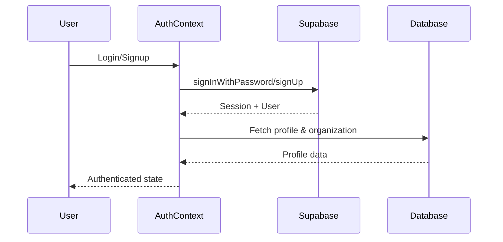

# Flowa - Technical Documentation

> Nền tảng Content Orchestration B2B cho thị trường Việt Nam

## 📚 Mục lục Tài liệu

| Tài liệu | Mô tả |
|----------|-------|
| [README.md](./README.md) | Tổng quan & Setup (file này) |
| [CORE-FEATURES.md](./CORE-FEATURES.md) | Các tính năng chính |
| [INDUSTRY-PARK.md](./INDUSTRY-PARK.md) | Hệ thống Industry Memory |
| [KNOWLEDGE-GRAPH.md](./KNOWLEDGE-GRAPH.md) | Knowledge Graph System |
| [EDGE-FUNCTIONS.md](./EDGE-FUNCTIONS.md) | Backend Edge Functions |
| [DATABASE-SCHEMA.md](./DATABASE-SCHEMA.md) | Database Architecture |
| [ARCHITECTURE.md](./ARCHITECTURE.md) | Industry Park v2.1 Deep Dive |

---

## 🎯 Flowa là gì?

Flowa là một **Content Orchestration Platform** được thiết kế cho doanh nghiệp B2B tại Việt Nam. Nền tảng giúp:

1. **Tạo nội dung AI-powered** tuân thủ quy định ngành
2. **Quản lý Brand Voice** nhất quán trên mọi kênh
3. **Lên lịch & phân phối** nội dung đa nền tảng
4. **Đảm bảo compliance** với Industry Memory system

### Điểm khác biệt chiến lược

```
┌─────────────────────────────────────────────────────────────┐
│                    PRIORITY CASCADE                          │
├─────────────────────────────────────────────────────────────┤
│  🔒 Industry Memory (Immutable) - Quy định ngành            │
│     ↓                                                        │
│  🎨 Brand Voice (Customizable) - Giọng điệu thương hiệu     │
│     ↓                                                        │
│  📱 Channel Rules - Quy tắc theo nền tảng                   │
│     ↓                                                        │
│  ⚙️  System Defaults - Mặc định hệ thống                     │
└─────────────────────────────────────────────────────────────┘
```

---

## 🛠 Tech Stack

### Frontend
| Technology | Version | Purpose |
|------------|---------|---------|
| React | 18.3 | UI Framework |
| TypeScript | 5.x | Type Safety |
| Vite | 5.x | Build Tool |
| Tailwind CSS | 3.x | Styling |
| TanStack Query | 5.x | Server State |
| React Router | 6.x | Routing |
| Framer Motion | 12.x | Animations |
| shadcn/ui | Latest | Component Library |

### Backend (Lovable Cloud / Supabase)
| Technology | Purpose |
|------------|---------|
| PostgreSQL | Database |
| Edge Functions (Deno) | Serverless Backend |
| Row Level Security | Data Isolation |
| Realtime | Live Updates |
| Storage | File Management |

### AI Infrastructure
| Provider | Models | Use Case |
|----------|--------|----------|
| Lovable Gateway | GPT-5, Gemini 2.5/3 | Content Generation |
| Supabase AI | gte-small (384d) | Embeddings |

---

## 📁 Cấu trúc Project

```
flowa/
├── docs/                          # 📚 Technical Documentation
│   ├── README.md                  # Entry point (file này)
│   ├── ARCHITECTURE.md            # Industry Park v2.1 spec
│   ├── CORE-FEATURES.md           # Feature overview
│   ├── INDUSTRY-PARK.md           # Industry Memory
│   ├── KNOWLEDGE-GRAPH.md         # Knowledge Graph
│   ├── EDGE-FUNCTIONS.md          # Backend functions
│   └── DATABASE-SCHEMA.md         # Database schema
│
├── src/
│   ├── components/                # 🧩 React Components
│   │   ├── ui/                    # shadcn/ui base components
│   │   ├── admin/                 # Admin dashboard components
│   │   ├── brand/                 # Brand management
│   │   ├── topic/                 # Topic hub & chatbot
│   │   ├── carousel/              # Carousel generator
│   │   ├── scripts/               # Script generator
│   │   └── shared/                # Shared components
│   │
│   ├── pages/                     # 📄 Route Pages
│   │   ├── Index.tsx              # Landing page (flowa.one)
│   │   ├── Dashboard.tsx          # Main dashboard
│   │   ├── Topics.tsx             # Topic Hub
│   │   ├── Scripts.tsx            # Script Generator
│   │   ├── Carousel.tsx           # Carousel Generator
│   │   ├── MultiChannel.tsx       # Multi-channel Content
│   │   └── admin/                 # Admin pages
│   │
│   ├── hooks/                     # 🎣 Custom Hooks
│   │   ├── ai/                    # AI-related hooks
│   │   ├── useTopics.ts           # Topic management
│   │   ├── useBrandTemplate.ts    # Brand template
│   │   ├── useIndustryMemory.ts   # Industry Memory
│   │   └── ...
│   │
│   ├── contexts/                  # 🌐 React Contexts
│   │   ├── AuthContext.tsx        # Authentication
│   │   └── ...
│   │
│   ├── types/                     # 📝 TypeScript Types
│   │   ├── knowledgeGraph.ts      # Knowledge Graph types
│   │   ├── topicDiscovery.ts      # Topic types
│   │   └── ...
│   │
│   ├── utils/                     # 🔧 Utility Functions
│   │   └── ...
│   │
│   └── integrations/
│       └── supabase/
│           ├── client.ts          # Supabase client (auto-generated)
│           └── types.ts           # DB types (auto-generated)
│
├── supabase/
│   ├── functions/                 # ⚡ Edge Functions
│   │   ├── _shared/               # Shared modules
│   │   ├── generate-script/       # Script generation
│   │   ├── generate-carousel/     # Carousel generation
│   │   ├── topic-ai/              # Topic chatbot
│   │   └── ... (100+ functions)
│   │
│   ├── migrations/                # 📊 Database Migrations
│   └── config.toml                # Supabase config
│
└── public/                        # Static assets
```

---

## 🚀 Quick Start

### Prerequisites
- Node.js 18+ (recommend using nvm)
- npm or bun

### Setup

```bash
# 1. Clone repository
git clone <YOUR_GIT_URL>
cd <PROJECT_NAME>

# 2. Install dependencies
npm install

# 3. Start development server
npm run dev
```

### Environment Variables

Project sử dụng Lovable Cloud, các biến môi trường được tự động cấu hình:

```env
VITE_SUPABASE_URL=https://rllyipiyuptkibqinotz.supabase.co
VITE_SUPABASE_PUBLISHABLE_KEY=eyJ...
VITE_SUPABASE_PROJECT_ID=rllyipiyuptkibqinotz
```

> ⚠️ **Lưu ý**: Không chỉnh sửa các file auto-generated:
> - `src/integrations/supabase/client.ts`
> - `src/integrations/supabase/types.ts`
> - `.env`
> - `supabase/config.toml`

---

## 🌐 Domain Routing

```
┌─────────────────────────────────────────────────────────┐
│  flowa.one          →  Marketing Landing Page           │
│  app.flowa.one      →  Application Dashboard            │
│  help.flowa.one     →  Help Center                      │
└─────────────────────────────────────────────────────────┘
```

**Routing Logic** (`src/App.tsx`):
```typescript
const isAppSubdomain = hostname.startsWith('app.');
const isHelpSubdomain = hostname.startsWith('help.');

if (isAppSubdomain) {
  // Redirect / to /dashboard
} else if (isHelpSubdomain) {
  // Help center routes
} else {
  // Marketing routes
}
```

---

## 🔐 Authentication

### Flow



### Key Components

```typescript
// src/contexts/AuthContext.tsx
interface AuthContextType {
  session: Session | null;
  user: User | null;
  profile: Profile | null;
  organization: Organization | null;
  isLoading: boolean;
  signIn: (email: string, password: string) => Promise<void>;
  signUp: (email: string, password: string) => Promise<void>;
  signOut: () => Promise<void>;
}
```

### Protected Routes

```typescript
// Usage
<ProtectedRoute>
  <Dashboard />
</ProtectedRoute>

// Admin-only
<ProtectedRoute requiredRole="admin">
  <AdminDashboard />
</ProtectedRoute>
```

---

## 🎨 Design System

### Color Tokens (HSL)

```css
/* index.css */
:root {
  --background: 0 0% 100%;
  --foreground: 222.2 84% 4.9%;
  --primary: 221.2 83.2% 53.3%;
  --secondary: 210 40% 96.1%;
  --muted: 210 40% 96.1%;
  --accent: 210 40% 96.1%;
  /* ... */
}

.dark {
  --background: 222.2 84% 4.9%;
  --foreground: 210 40% 98%;
  /* ... */
}
```

### Usage

```tsx
// ✅ Correct - Use semantic tokens
<div className="bg-primary text-primary-foreground">
<div className="text-muted-foreground">
<div className="border-border">

// ❌ Wrong - Don't use raw colors
<div className="bg-blue-500 text-white">
```

---

## 📊 Data Fetching Pattern

### TanStack Query

```typescript
// hooks/useTopics.ts
export function useTopics(brandTemplateId: string) {
  return useQuery({
    queryKey: ['topics', brandTemplateId],
    queryFn: async () => {
      const { data, error } = await supabase
        .from('topics')
        .select('*')
        .eq('brand_template_id', brandTemplateId)
        .order('created_at', { ascending: false });
      
      if (error) throw error;
      return data;
    },
    enabled: !!brandTemplateId,
  });
}

// Mutations
export function useCreateTopic() {
  const queryClient = useQueryClient();
  
  return useMutation({
    mutationFn: async (topic: TopicInsert) => {
      const { data, error } = await supabase
        .from('topics')
        .insert(topic)
        .select()
        .single();
      
      if (error) throw error;
      return data;
    },
    onSuccess: () => {
      queryClient.invalidateQueries({ queryKey: ['topics'] });
    },
  });
}
```

---

## 🔄 State Management

### Server State
- **TanStack Query** cho data từ backend
- Cache invalidation pattern
- Optimistic updates

### Client State
- **React Context** cho global state (Auth, Theme)
- **useState/useReducer** cho local component state
- **URL state** cho filters, pagination

### Example Pattern

```typescript
// URL state for filters
const [searchParams, setSearchParams] = useSearchParams();
const tab = searchParams.get('tab') || 'explorer';
const packId = searchParams.get('packId');

// Update URL
setSearchParams({ tab: 'sources', packId: selectedId });
```

---

## 🧪 Testing

### Unit Tests (Vitest)

```bash
npm run test
```

### Test Structure

```
src/
├── components/
│   └── MyComponent.tsx
│   └── MyComponent.test.tsx  # Co-located tests
└── utils/
    └── helpers.ts
    └── helpers.test.ts
```

---

## 📝 Coding Conventions

### File Naming
- Components: `PascalCase.tsx`
- Hooks: `useCamelCase.ts`
- Utils: `camelCase.ts`
- Types: `camelCase.ts`

### Component Structure

```typescript
// 1. Imports
import { useState } from 'react';
import { Button } from '@/components/ui/button';

// 2. Types
interface MyComponentProps {
  title: string;
  onAction?: () => void;
}

// 3. Component
export function MyComponent({ title, onAction }: MyComponentProps) {
  // Hooks
  const [state, setState] = useState(false);
  
  // Handlers
  const handleClick = () => {
    onAction?.();
  };
  
  // Render
  return (
    <div>
      <h1>{title}</h1>
      <Button onClick={handleClick}>Action</Button>
    </div>
  );
}
```

### Import Aliases

```typescript
// Use @ alias for src/
import { Button } from '@/components/ui/button';
import { useTopics } from '@/hooks/useTopics';
import { supabase } from '@/integrations/supabase/client';
```

---

## 🚢 Deployment

### Lovable Platform

1. **Preview**: Automatic on every change
2. **Publish**: Share → Publish button
3. **Custom Domain**: Settings → Domains

### Edge Functions

Edge Functions được deploy tự động khi có thay đổi trong `supabase/functions/`.

---

## 🔗 Quick Links

- **Lovable Project**: [lovable.dev/projects/{id}](https://lovable.dev)
- **Design System**: [shadcn/ui](https://ui.shadcn.com)
- **Icons**: [Lucide Icons](https://lucide.dev)
- **TanStack Query**: [tanstack.com/query](https://tanstack.com/query)

---

## 📞 Support

Nếu cần hỗ trợ, liên hệ team lead hoặc tạo issue trong repository.
